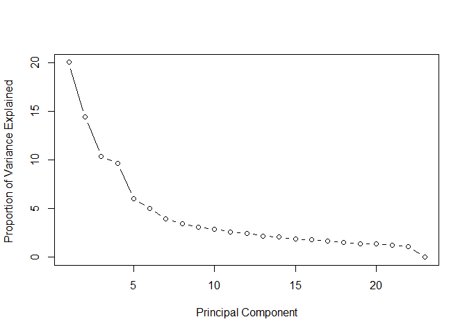

> Outline

1. Abstract 
2. IPQC data analysis (Part 1)
    + 2.1 Knowing the data
        - 2.1.1 Original data
        - 2.2.2 Data after preprocessing
    + 2.2 Analysis 
        - 2.2.1 SMOTE + Decision Tree
        - 2.2.2 SMOTE + Random Forest
        - 2.2.3 ROSE + Decision Tree
        - 2.2.4 ROSE + Random Forest
    + 2.3 Compare ROC curve
3. IPQC + FQC data analysis (Part 2)
    + 3.1 Filter variables directly by standard deviation
        - 3.1.1 Clustering without PCA
        - 3.1.2 PCA + Clustering
    + 3.2 Fiter variables by standard deviation after grouping dimensions
        - 3.2.1 Clustering without PCA
        - 3.2.2 PCA + Clustering

# 1. Abstract
Machine learning models to predict the quality of manufacturing of blood glucose test strips are presented in this study. A variety of models are built by inspection data from an anonymous manufacturer in Taiwan. The aim of this study is to predict the quality of the strips in advance and to reduce the cost of defective products before shipment.
The proposed approach is divided into two parts. In-Process Quality Control (IPQC) data are examined in the first part. Since the data of defective products are relatively rare, we should make the data more balanced before building a model. Synthetic Minority Over-Sampling Technique (SMOTE) and Random Over-sampling Example (ROSE) are used to balance the data, and subsequently classification models are developed by the decision tree and random forest. Evaluation results from Receiver Operating Characteristic Curve (ROC) show that the decision tree and random forest after SMOTE have better performance than the counterpart of ROSE model.
After exploring the IPQC data, the second part of this study combines different inspection results of blood glucose test strips under same batch of raw materials. Standard deviation filtering and Principal Component Analysis (PCA) are used to select or extract appropriate features before building the models. Different clusterings from K-means, hierarchical, and K-medoids methods are employed to facilitate the understanding on quality grading for blood glucose test strips. Different clusterings are externally validated against original category labels. Results show that performance of more than three groups degrades significantly regardless of the cluster methods.

#### The process of this study as below.  


```r
knitr::include_graphics("C:/Users/Christine Liou/Documents/Quality-prediction-for-the-manufacturing-of-the-blood-glucose-strips/Analysis process.jpg")
```


# 2. IPQC data analysis (Part 1)
## 2.1 Knowing the data
### 2.1.1 Original data
The below data is original excel inputting from the company. It is quiet massy, so we need to extract, transform and reorganized. 

```r
library(xlsx)
IPQC_2233_GCS <- read.xlsx("~/HMD/data-20180426/IPQC/C4H82233-IPQC.xls",encoding="UTF-8",startRow =10,endRow = 23,sheetIndex = 1 )
IPQC_2233_GCS
```

```
##    GCS.Level Level.1 Level.1.1 Level.1.2 Level.1.3 Level.2 Level.2.1
## 1  GCS Model   GCS31     GCS31     GCS31     GCS31   GCS33     GCS33
## 2    ROW NO.       3         4         5         6       1         2
## 3  Meter No.      02        03        04        05      02        03
## 4    1(左吸)      41        41        35        41     293       298
## 5    2(左吸)      41        41        35        41     292       291
## 6    3(左吸)      42        41        37        39     286       303
## 7    4(左吸)      40        41        33        42     294       298
## 8    5(左吸)      42        41        36        41     293       301
## 9    6(右吸)      41        41        34        42     298       296
## 10   7(右吸)      41        41        32        42     293       291
## 11   8(右吸)      40        41        41        41     302       300
## 12   9(右吸)      41        40        42        42     295       295
## 13  10(右吸)      40        42        40        42     289       298
##    Level.2.2 Level.2.3 NA. NA..1 NA..2 NA..3 NA..4 NA..5 NA..6 NA..7 NA..8
## 1      GCS33     GCS33  NA    NA    NA    NA    NA    NA    NA    NA    NA
## 2          3         4  NA    NA    NA    NA    NA    NA    NA    NA    NA
## 3         04        05  NA    NA    NA    NA    NA    NA    NA    NA    NA
## 4        306       308  NA    NA    NA    NA     0     0     0     0     0
## 5        302       311  NA    NA    NA    NA     0     0     0     0     0
## 6        315       309  NA    NA    NA    NA     0     0     0     0     0
## 7        301       313  NA    NA    NA    NA     0     0     0     0     0
## 8        306       313  NA    NA    NA    NA     0     0     0     0     0
## 9        306       317  NA    NA    NA    NA     0     0     0     0     0
## 10       308       306  NA    NA    NA    NA     0     0     0     0     0
## 11       303       296  NA    NA    NA    NA     0     0     0     0     0
## 12       282       306  NA    NA    NA    NA     0     0     0     0     0
## 13       291       302  NA    NA    NA    NA     0     0     0     0     0
##    NA..9 NA..10 NA..11
## 1     NA     NA     NA
## 2     NA     NA     NA
## 3     NA     NA     NA
## 4      0      0      0
## 5      0      0      0
## 6      0      0      0
## 7      0      0      0
## 8      0      0      0
## 9      0      0      0
## 10     0      0      0
## 11     0      0      0
## 12     0      0      0
## 13     0      0      0
```


```r
library(reshape2)
IPQC_2233_GCS <- IPQC_2233_GCS[,1:9]
lookup <- IPQC_2233_GCS[1:3,]
lookup <- sapply(lookup,as.character)
lookup <- rbind(colnames(lookup),lookup)
colnames(lookup) <- NULL
lookup <- t(lookup)
lookup <- as.data.frame(lookup)
colnames(lookup) <- c("Level", "GCS","Row","Meter")
lookup <- lookup [-1,]
lapply(lookup, table, useNA = "ifany")
```

```
## $Level
## 
## GCS.Level   Level.1 Level.1.1 Level.1.2 Level.1.3   Level.2 Level.2.1 
##         0         1         1         1         1         1         1 
## Level.2.2 Level.2.3 
##         1         1 
## 
## $GCS
## 
## GCS Model     GCS31     GCS33 
##         0         4         4 
## 
## $Row
## 
##       1       2       3       4       5       6 ROW NO. 
##       1       1       2       2       1       1       0 
## 
## $Meter
## 
##        02        03        04        05 Meter No. 
##         2         2         2         2         0
```

```r
lookup$Level <- factor(lookup$Level)
lookup$Meter <- factor(lookup$Meter)
lookup$Row <- factor(lookup$Row)

IPQC_2233_GCS <- IPQC_2233_GCS[-(1:3),]
colnames(IPQC_2233_GCS)[1] <- "obs"

lIPQC_2233_GCS <- melt(IPQC_2233_GCS,id.vars = "obs", measure.vars = colnames(IPQC_2233_GCS)[-1],variable.name = "Level",value.name = "bg")
lIPQC_2233_GCS <- merge(lookup,lIPQC_2233_GCS,by="Level")
lIPQC_2233_GCS$Level <- ifelse(lIPQC_2233_GCS$Level == "Level.1" | lIPQC_2233_GCS$Level == "Level.1.1" | lIPQC_2233_GCS$Level == "Level.1.2"| lIPQC_2233_GCS$Level == "Level.1.3", "I", ifelse(lIPQC_2233_GCS$Level == "Level.2" | lIPQC_2233_GCS$Level == "Level.2.1" | lIPQC_2233_GCS$Level == "Level.2.2"| lIPQC_2233_GCS$Level =="Level.2.3", "II", lIPQC_2233_GCS$Level))
lIPQC_2233_GCS$bg <- as.numeric(lIPQC_2233_GCS$bg)
lIPQC_2233_GCS$Row <- as.character(lIPQC_2233_GCS$Row)

lIPQC_2233_GCS$ave_bg <- ave(lIPQC_2233_GCS$bg, list(lIPQC_2233_GCS$Row,lIPQC_2233_GCS$Level), FUN = function(x) mean(x, na.rm = TRUE))
lIPQC_2233_GCS$ave_rdiff <- lIPQC_2233_GCS$bg - lIPQC_2233_GCS$ave_bg
lIPQC_2233_GCS$ave_rdiffpc <- (lIPQC_2233_GCS$ave_rdiff/lIPQC_2233_GCS$ave_bg)*100
head(lIPQC_2233_GCS)
```

```
##   Level   GCS Row Meter     obs bg ave_bg ave_rdiff ave_rdiffpc
## 1     I GCS31   3    02 1(左吸) 41   40.9       0.1   0.2444988
## 2     I GCS31   3    02 2(左吸) 41   40.9       0.1   0.2444988
## 3     I GCS31   3    02 3(左吸) 42   40.9       1.1   2.6894866
## 4     I GCS31   3    02 4(左吸) 40   40.9      -0.9  -2.2004890
## 5     I GCS31   3    02 5(左吸) 42   40.9       1.1   2.6894866
## 6     I GCS31   3    02 6(右吸) 41   40.9       0.1   0.2444988
```

### 2.1.2 Data after preprocessing
After cleaning, transforming, and calculating, the whole IPQC data is combined. The first column marks the strips pass or not. The two to seven columns are the strip's tags, shows us the pass level, the batch name, the blood sugar rate levels, the row, the estimated meter, and the observed number. The "bg" column is the strip tested outcome. We use the same real blood to test the strip. Therefore, based on the same testing blood, the outcome of the strip should nearly the same. If the "bg" quite different from other strips, that means the strip might be bad quality. 


```r
load("~/HMD/RDATA/IPQC_all.RData")
head(IPQC)
```

```
##   passornot passlevel name Level Row Meter     obs bg ave_bg ave_rdiff
## 1      pass         A 2223     I   3    02 1(左吸) 40   39.5       0.5
## 2      pass         A 2223     I   3    02 2(左吸) 38   39.5      -1.5
## 3      pass         A 2223     I   3    02 3(左吸) 39   39.5      -0.5
## 4      pass         A 2223     I   3    02 4(左吸) 40   39.5       0.5
## 5      pass         A 2223     I   3    02 5(左吸) 40   39.5       0.5
## 6      pass         A 2223     I   3    02 6(右吸) 40   39.5       0.5
##   ave_rdiffpc
## 1    1.265823
## 2   -3.797468
## 3   -1.265823
## 4    1.265823
## 5    1.265823
## 6    1.265823
```

After removing the outlier based on boxplot, the strips with the same Row and obs are drawn a boxplot according to the 'ave_rdiffpc'(averaged of the row difference percentage). As we can see, the boxplots of the pass have more similar average and IQR than NG.

```r
library(dplyr)
```

```
## 
## Attaching package: 'dplyr'
```

```
## The following objects are masked from 'package:stats':
## 
##     filter, lag
```

```
## The following objects are masked from 'package:base':
## 
##     intersect, setdiff, setequal, union
```

```r
IPQC_PASS <- filter(IPQC, IPQC$passornot=="pass")
IPQC_NG <- filter(IPQC, IPQC$passornot=="NG")
a <- which(IPQC_PASS$ave_rdiffpc %in% boxplot.stats(IPQC_PASS$ave_rdiffpc)$out) #removed the outlier
IPQC_PASS <- IPQC_PASS[-a,]
IPQC <- rbind(IPQC_PASS,IPQC_NG)

library(ggplot2)
p_naout <- ggplot(IPQC, aes(x=obs, y=ave_rdiffpc))+ geom_boxplot() + theme(axis.text.x = element_text(angle = 45))+ facet_grid(Row ~passornot)+ scale_x_discrete(limits= c("1(左吸)","2(左吸)","3(左吸)","4(左吸)","5(左吸)","6(右吸)","7(右吸)","8(右吸)","9(右吸)","10(右吸)")) 
p_naout+ ggtitle("Boxplot IPQC before balance_remove pass outlier")
```

<!-- -->

The difference between pass and NG might have two reasons. First, the variance of the data should be small result in the pass strips. In other words, because ave_rdiffpc of the strips are quite diverse, the strips are not passed. Therefore, the boxplot in the NG part has different shapes. The other reason might be the number of data. With fewer collected data, the boxplot of NG would be quiet different. 
According to the codes below, we have 3993 pass data and only 160 NG data. 

```r
library(DMwR)
```

```
## Loading required package: lattice
```

```
## Loading required package: grid
```

```r
set.seed(1111)
table(IPQC$passornot)
```

```
## 
## pass   NG 
## 3993  160
```

## 2.2 Analysis
### 2.2.1 SMOTE + Decision Tree
Our data is imbalanced data. Applying machine learning model with imbalance data often causes the model to develop a bias towards the majority class. Therefore, we should balance the data first and then build the classification model. SMOTE is based on nearest neighbors judged by Euclidean Distance between data points in feature space. It selects examples that are close in the feature space, drawing a line between the examples in the feature space and drawing a new sample at a point along that line.

```r
IPQC_SMOTE <- SMOTE(passornot ~ ., IPQC, perc.over = 1150,perc.under=150)
table(IPQC_SMOTE$passornot)
```

```
## 
## pass   NG 
## 2640 1920
```

After SMOTE, as we can see the  NG boxplot at the right side has better performance. The boxplots look quite similar. 

```r
smote <- ggplot(IPQC_SMOTE, aes(x=obs, y=ave_rdiffpc))+ geom_boxplot() + theme(axis.text.x = element_text(angle = 45))+ facet_grid(Row ~passornot)+ scale_x_discrete(limits= c("1(左吸)","2(左吸)","3(左吸)","4(左吸)","5(左吸)","6(右吸)","7(右吸)","8(右吸)","9(右吸)","10(右吸)")) 
smote + ggtitle("Boxplot IPQC after SMOTE")
```

<!-- -->

Separate the data into training set and testing set.

```r
### 資料切分
np <- ceiling(0.1*nrow(IPQC_SMOTE))
test <- sample(1:nrow(IPQC_SMOTE),np)
IPQC_test <- IPQC_SMOTE[test,]
IPQC_train <- IPQC_SMOTE[-test,]

table(IPQC_train$passornot)/nrow(IPQC_train)
```

```
## 
##      pass        NG 
## 0.5772417 0.4227583
```

```r
table(IPQC_test$passornot)/nrow(IPQC_test)
```

```
## 
##      pass        NG 
## 0.5942982 0.4057018
```

Build the decision tree by rpart. 

```r
library(rpart)
IPQC_tree <- rpart(passornot ~   Row+obs + ave_rdiffpc, 
                   data = IPQC_train,
                   method = "class")  
IPQC_tree
```

```
## n= 4104 
## 
## node), split, n, loss, yval, (yprob)
##       * denotes terminal node
## 
##  1) root 4104 1735 pass (0.5772417 0.4227583)  
##    2) Row=1,2,4,5,6 2449  694 pass (0.7166190 0.2833810) *
##    3) Row=3 1655  614 NG (0.3709970 0.6290030)  
##      6) obs=1(左吸),10(右吸),7(右吸),8(右吸),9(右吸) 591  279 pass (0.5279188 0.4720812)  
##       12) ave_rdiffpc>=-1.892034 429  174 pass (0.5944056 0.4055944) *
##       13) ave_rdiffpc< -1.892034 162   57 NG (0.3518519 0.6481481) *
##      7) obs=2(左吸),3(左吸),4(左吸),5(左吸),6(右吸) 1064  302 NG (0.2838346 0.7161654) *
```

Pruning

```r
### 剪枝
printcp(IPQC_tree)
```

```
## 
## Classification tree:
## rpart(formula = passornot ~ Row + obs + ave_rdiffpc, data = IPQC_train, 
##     method = "class")
## 
## Variables actually used in tree construction:
## [1] ave_rdiffpc obs         Row        
## 
## Root node error: 1735/4104 = 0.42276
## 
## n= 4104 
## 
##         CP nsplit rel error  xerror     xstd
## 1 0.246110      0   1.00000 1.00000 0.018240
## 2 0.023343      1   0.75389 0.75389 0.017206
## 3 0.010000      3   0.70720 0.70893 0.016916
```

```r
plotcp(IPQC_tree)
```

<!-- -->

```r
#取最小錯誤率剪枝
prunetree_IPQC <- prune(IPQC_tree, cp = IPQC_tree$cptable[which.min(IPQC_tree$cptable[,"xerror"]),"CP"])

#取最小錯誤率加上一倍標準誤
opt <- which.min(IPQC_tree$cptable[,"xerror"])
oneSe <- which(IPQC_tree$cptable[, "rel error"] < 
                IPQC_tree$cptable[opt,"xerror"] + IPQC_tree$cptable[opt, "xstd"])[1]

cpOneSe <- IPQC_tree$cptable[oneSe, "CP"]
IPQC_pruneOneSe <- prune(IPQC_tree, cp = cpOneSe)

knitr::kable(
  IPQC_tree$cptable, caption = ' 分類樹複雜度參數表',
  booktabs = TRUE
)
```


Table:  分類樹複雜度參數表

        CP   nsplit   rel error      xerror        xstd
----------  -------  ----------  ----------  ----------
 0.2461095        0   1.0000000   1.0000000   0.0182402
 0.0233429        1   0.7538905   0.7538905   0.0172056
 0.0100000        3   0.7072046   0.7089337   0.0169158

Visualize the result of the tree.

```r
### 畫圖
library(rpart.plot)
#opar<-par(no.readonly = T)
#par(mfrow=c(1,2))
rpart.plot(IPQC_tree, digits = 3, cex=0.8, sub="剪枝前")
```

<!-- -->

```r
rpart.plot(prunetree_IPQC, digits = 3, cex=0.8, sub="剪枝後")
```

<!-- -->

```r
rpart.plot(IPQC_pruneOneSe, digits = 3, cex=0.8, sub="onese剪枝後")
```

<!-- -->

```r
#剪枝前後差不多，因為cp最小取0.01，而原本rpart預設值就是0.01所以沒啥差
```

Calculate the accuracy and sensitivity of training set.

```r
#訓練集
passornot_train <- IPQC_SMOTE$passornot[-test]
train_prob <- predict(IPQC_tree,IPQC_train, type = "prob")
train_label <- predict(IPQC_tree,IPQC_train, type = "class")

table_train <- table(passornot_train,train_label)
correct_train <- sum(diag(table_train))/sum(table_train)*100
correct_train #69.56699
```

```
## [1] 70.10234
```

```r
sensitivity <- table_train[2,2]/sum(table_train[2,])*100
sensitivity # 69.99227
```

```
## [1] 49.97118
```

Calculate the accuracy and sensitivity of testing set. 

```r
#測試集
passornot_test <- IPQC_SMOTE$passornot[test]
test_prob <- predict(IPQC_tree,IPQC_test, type = "prob")
test_label <- predict(IPQC_tree,IPQC_test, type = "class")
table_test <- table(passornot_test,test_label)
# data.frame(test_prob, test_label)
correct_test <- sum(diag(table_test))/sum(table_test)*100
correct_test #訓練集資料正確率 63.23529 %  
```

```
## [1] 67.54386
```

```r
sensitivity <- table_test[2,2]/sum(table_test[2,])*100
sensitivity #測試集的sensitivity 65.98639%
```

```
## [1] 42.16216
```

Draw the ROC curve.

```r
### ROC curve
library(pROC)
```

```
## Type 'citation("pROC")' for a citation.
```

```
## 
## Attaching package: 'pROC'
```

```
## The following objects are masked from 'package:stats':
## 
##     cov, smooth, var
```

```r
levels(IPQC_test$passornot)
```

```
## [1] "pass" "NG"
```

```r
head(IPQC_test$passornot)
```

```
## [1] NG   NG   NG   NG   pass NG  
## Levels: pass NG
```

```r
str(IPQC_test$passornot) # "pass": 1, "NG":2
```

```
##  Factor w/ 2 levels "pass","NG": 2 2 2 2 1 2 1 2 2 2 ...
```

```r
modelroc_Stree <- roc(IPQC_test$passornot,test_prob[,"NG"]) # "pass": 1, "NG":2
```

```
## Setting levels: control = pass, case = NG
```

```
## Setting direction: controls < cases
```

```r
plot(modelroc_Stree, print.auc=TRUE, auc.polygon=TRUE, grid=c(0.1, 0.2),grid.col=c("green", "red"), max.auc.polygon=TRUE, auc.polygon.col="skyblue", print.thres=TRUE)
```

<!-- -->


```r
library(pROC)
modelroc_Stree <- roc(IPQC_test$passornot,test_prob[,"NG"]) # "pass": 1, "NG":2
```

```
## Setting levels: control = pass, case = NG
```

```
## Setting direction: controls < cases
```

### 2.2.2 SMOTE + Random Forest
Build the random forest model. 

```r
### 建隨機森林
library(randomForest)
```

```
## randomForest 4.6-14
```

```
## Type rfNews() to see new features/changes/bug fixes.
```

```
## 
## Attaching package: 'randomForest'
```

```
## The following object is masked from 'package:ggplot2':
## 
##     margin
```

```
## The following object is masked from 'package:dplyr':
## 
##     combine
```

```r
#set.seed(1117)
rf <- randomForest(passornot ~ Row + obs + ave_rdiffpc, data = IPQC_train, ntree = 100)
rf
```

```
## 
## Call:
##  randomForest(formula = passornot ~ Row + obs + ave_rdiffpc, data = IPQC_train,      ntree = 100) 
##                Type of random forest: classification
##                      Number of trees: 100
## No. of variables tried at each split: 1
## 
##         OOB estimate of  error rate: 28.53%
## Confusion matrix:
##      pass   NG class.error
## pass 1918  451   0.1903757
## NG    720 1015   0.4149856
```

```r
plot(rf)
```

<!-- -->


```r
### 變數重要性
importance(rf) 
```

```
##             MeanDecreaseGini
## Row                 247.9873
## obs                 157.0618
## ave_rdiffpc         280.7859
```

```r
varImpPlot(rf)
```

<!-- -->

Tuning the mtry 

```r
### CV調mtry
library(caret)
#set.seed(100)
mtryGrid <- data.frame(mtry = floor(seq(1, ncol(IPQC_train), length = 10)))
rfTune <- train(passornot ~ Row + obs + ave_rdiffpc, 
                data = IPQC_train,
                method = "rf",
                tuneGrid = mtryGrid,
                ntree = 100,
                importance = TRUE,
                trControl = trainControl(method = "cv",number = 10))
rfTune
```

```
## Random Forest 
## 
## 4104 samples
##    3 predictor
##    2 classes: 'pass', 'NG' 
## 
## No pre-processing
## Resampling: Cross-Validated (10 fold) 
## Summary of sample sizes: 3694, 3694, 3694, 3693, 3694, 3693, ... 
## Resampling results across tuning parameters:
## 
##   mtry  Accuracy   Kappa    
##    1    0.6608225  0.2393996
##    2    0.7005436  0.3667809
##    3    0.7039523  0.3761501
##    4    0.7115079  0.3932122
##    5    0.7212611  0.4149653
##    6    0.7261278  0.4260196
##    7    0.7370886  0.4505503
##    8    0.7405044  0.4582096
##    9    0.7446430  0.4676102
##   11    0.7485396  0.4752906
## 
## Accuracy was used to select the optimal model using the largest value.
## The final value used for the model was mtry = 11.
```

```r
plot(rfTune)
```

<!-- -->

Calculate the accuracy and sensitivity of testing set.

```r
passornot_test <- IPQC_SMOTE$passornot[test]
test_prob <- predict(rfTune,IPQC_test, type = "prob")
test_label <- predict(rfTune,IPQC_test, type = "raw")
table_test <- table(passornot_test,test_label)

correct_test <- sum(diag(table_test))/sum(table_test)*100
correct_test #測試集資料正確率 69.48529 %  
```

```
## [1] 74.7807
```

```r
sensitivity <- table_test[2,2]/sum(table_test[2,])*100
sensitivity #測試集的sensitivity 75.1634%
```

```
## [1] 59.45946
```


Plot the ROC curve. 

```r
### ROC
library(pROC)
modelroc_Srf <- roc(IPQC_test$passornot,test_prob[,"NG"]) # "pass": 1, "NG":2
```

```
## Setting levels: control = pass, case = NG
```

```
## Setting direction: controls < cases
```

```r
plot(modelroc_Srf, print.auc=TRUE, auc.polygon=TRUE, grid=c(0.1, 0.2),grid.col=c("green", "red"), max.auc.polygon=TRUE, auc.polygon.col="skyblue", print.thres=TRUE)
```

<!-- -->


### 2.2.3 ROSE + Decision Tree
In addition to using SMOTE to balance the data, I also use another method provided in R called ROSE(Random Over-sampling Example). After ROSE, the pass data and NG data have samilar number of data.

```r
library(ROSE)
```

```
## Loaded ROSE 0.0-3
```

```r
set.seed(111)
IPQC_ROSE <- ROSE(passornot~., data=IPQC,N=nrow(IPQC), p=0.5, seed=1, hmult.majo = 0.25, hmult.mino = 0.5)$data            
#ROSE函數包的人工合成數據(ROSE)、過採樣、欠採樣及融合過採樣和欠採樣，根據Nicola文章，ROSE的ROCcurve 表現優於其他三者，所以採用ROSE套件中的ROSE函數進行數據平衡

table(IPQC_ROSE$passornot)
```

```
## 
## pass   NG 
## 2151 2002
```

The boxplot after ROSE as below. 

```r
rose <- ggplot(IPQC_ROSE, aes(x=obs, y=ave_rdiffpc))+ geom_boxplot() + theme(axis.text.x = element_text(angle = 45))+ facet_grid(Row ~passornot)+ scale_x_discrete(limits= c("1(左吸)","2(左吸)","3(左吸)","4(左吸)","5(左吸)","6(右吸)","7(右吸)","8(右吸)","9(右吸)","10(右吸)")) 
rose+ ggtitle("Boxplot IPQC after ROSE")
```

<!-- -->

Saperate the data into training and testing set. 

```r
### 資料切分
np <- ceiling(0.1*nrow(IPQC_ROSE))
test <- sample(1:nrow(IPQC_ROSE),np)
IPQC_test <- IPQC_ROSE[test,]
IPQC_train <- IPQC_ROSE[-test,]
```


Build the decision tree. 

```r
### 建樹
library(rpart)
IPQC_tree <- rpart(passornot ~   Row + obs + ave_rdiffpc, method = "class", data = IPQC_train, control = rpart.control(minbucket = 200)) 

### 剪枝
printcp(IPQC_tree)
```

```
## 
## Classification tree:
## rpart(formula = passornot ~ Row + obs + ave_rdiffpc, data = IPQC_train, 
##     method = "class", control = rpart.control(minbucket = 200))
## 
## Variables actually used in tree construction:
## [1] ave_rdiffpc obs        
## 
## Root node error: 1797/3737 = 0.48087
## 
## n= 3737 
## 
##         CP nsplit rel error  xerror     xstd
## 1 0.094880      0   1.00000 1.00000 0.016997
## 2 0.012521      2   0.81024 0.83027 0.016660
## 3 0.010000      4   0.78520 0.82526 0.016643
```

```r
plotcp(IPQC_tree)
```

<!-- -->

```r
prunetree_IPQC <- prune(IPQC_tree, cp = IPQC_tree$cptable[which.min(IPQC_tree$cptable[,"xerror"]),"CP"])


### 畫圖
library(rpart.plot)
#opar<-par(no.readonly = T)
#par(mfrow=c(1,2))
rpart.plot(IPQC_tree, digits = 3, cex=0.8, sub="剪枝前")
```

<!-- -->

```r
rpart.plot(prunetree_IPQC, digits = 3, cex=0.8)
```

<!-- -->

```r
#剪枝前後一樣

rpart.rules(x = IPQC_tree,cover = TRUE)
```

```
##  passornot                                                                                                                       cover
##       0.32 when ave_rdiffpc is -3.8 to  2.5 & obs is                                            10(右吸) or 4(左吸) or 8(右吸)     20%
##       0.42 when ave_rdiffpc is -1.9 to  2.5 & obs is 1(左吸) or 2(左吸) or 3(左吸) or 5(左吸) or 6(右吸) or 7(右吸) or 9(右吸)     45%
##       0.56 when ave_rdiffpc is -3.8 to -1.9 & obs is 1(左吸) or 2(左吸) or 3(左吸) or 5(左吸) or 6(右吸) or 7(右吸) or 9(右吸)     10%
##       0.65 when ave_rdiffpc >=          2.5                                                                                        16%
##       0.77 when ave_rdiffpc <  -3.8                                                                                                 8%
```

Calculate the accuracy and sensitivity of training set.


```r
### 模型評估
#訓練集
passornot_train <- IPQC_ROSE$passornot[-test]
train_prob <- predict(IPQC_tree,IPQC_train, type = "prob")
train_label <- predict(IPQC_tree,IPQC_train, type = "class")

table_train <- table(passornot_train,train_label)
correct_train <- sum(diag(table_train))/sum(table_train)*100
correct_train #69.56699
```

```
## [1] 62.24244
```

```r
sensitivity <- table_train[2,2]/sum(table_train[2,])*100
sensitivity # 69.99227
```

```
## [1] 46.57763
```

Calculate the accuracy and sensitivity of training set.

```r
#測試集的正確率
passornot_test <- IPQC_ROSE$passornot[test]
test_prob <- predict(IPQC_tree,IPQC_test, type = "prob")
test_label <- predict(IPQC_tree,IPQC_test, type = "class")
table_test <- table(passornot_test,test_label)
# data.frame(test_prob, test_label)

correct_test <- sum(diag(table_test))/sum(table_test)*100
correct_test #測試集資料正確率 71.2963 %  
```

```
## [1] 58.17308
```

```r
sensitivity <- table_test[2,2]/sum(table_test[2,])*100
sensitivity #測試集的sensitivity 15.38462 %
```

```
## [1] 42.92683
```


Draw the ROC curve.

```r
# ROC
library(pROC)
modelroc_Rtree <- roc(IPQC_test$passornot,test_prob[,"NG"]) # "pass": 1, "NG":2
```

```
## Setting levels: control = pass, case = NG
```

```
## Setting direction: controls < cases
```

```r
plot(modelroc_Rtree, print.auc=TRUE, auc.polygon=TRUE, grid=c(0.1, 0.2),grid.col=c("green", "red"), max.auc.polygon=TRUE, auc.polygon.col="skyblue", print.thres=TRUE)
```

<!-- -->

### 2.2.4 ROSE + Random Forest
Build the random forest model.

```r
#建森林
library(randomForest)
#set.seed(111)
rf <- randomForest(passornot ~ Row + obs + ave_rdiffpc, data = IPQC_train, ntree = 100)
rf_predict <- predict(rf, newdata = IPQC_test)
rf 
```

```
## 
## Call:
##  randomForest(formula = passornot ~ Row + obs + ave_rdiffpc, data = IPQC_train,      ntree = 100) 
##                Type of random forest: classification
##                      Number of trees: 100
## No. of variables tried at each split: 1
## 
##         OOB estimate of  error rate: 34.15%
## Confusion matrix:
##      pass  NG class.error
## pass 1597 343   0.1768041
## NG    933 864   0.5191987
```

```r
plot(rf)
```

<!-- -->


Tuning the mtry. 

```r
### CV調mtry
library(caret)
#set.seed(100)
mtryGrid <- data.frame(mtry = floor(seq(1, ncol(IPQC_train), length = 10)))
rfTune <- train(passornot ~ Row + obs + ave_rdiffpc, 
                data = IPQC_train,
                method = "rf",
                tuneGrid = mtryGrid,
                ntree = 100,
                importance = TRUE,
                trControl = trainControl(method = "cv",number = 10))
rfTune
```

```
## Random Forest 
## 
## 3737 samples
##    3 predictor
##    2 classes: 'pass', 'NG' 
## 
## No pre-processing
## Resampling: Cross-Validated (10 fold) 
## Summary of sample sizes: 3363, 3364, 3364, 3363, 3363, 3363, ... 
## Resampling results across tuning parameters:
## 
##   mtry  Accuracy   Kappa      
##    1    0.5210105  0.004451362
##    2    0.5654256  0.106690926
##    3    0.6208226  0.227613311
##    4    0.6577511  0.306189700
##    5    0.6783573  0.350410577
##    6    0.6847773  0.365260253
##    7    0.6845149  0.366161631
##    8    0.6882589  0.374066770
##    9    0.6845185  0.366905899
##   11    0.6724692  0.343228642
## 
## Accuracy was used to select the optimal model using the largest value.
## The final value used for the model was mtry = 8.
```

```r
plot(rfTune)
```

<!-- -->

Calculate the accuracy and sensitivity of testing set.

```r
### 測試集評估

passornot_test <- IPQC_ROSE$passornot[test]
test_prob <- predict(rf,IPQC_test, type = "prob")
test_label <- predict(rfTune,IPQC_test, type = "raw")
table_test <- table(passornot_test,test_label)

correct_test <- sum(diag(table_test))/sum(table_test)*100
correct_test #測試集資料正確率 69.48529 %  
```

```
## [1] 67.54808
```

```r
sensitivity <- table_test[2,2]/sum(table_test[2,])*100
sensitivity #測試集的sensitivity 75.1634%
```

```
## [1] 62.92683
```


Draw ROC curve

```r
### ROC
library(pROC)
modelroc_Rrf <- roc(IPQC_test$passornot,test_prob[,"NG"]) # "pass": 1, "NG":2
```

```
## Setting levels: control = pass, case = NG
```

```
## Setting direction: controls < cases
```

```r
plot(modelroc_Rrf, print.auc=TRUE, auc.polygon=TRUE, grid=c(0.1, 0.2),grid.col=c("green", "red"), max.auc.polygon=TRUE, auc.polygon.col="skyblue", print.thres=TRUE)
```

<!-- -->

```r
### 變數重要性
rfImp <- varImp(rfTune, scale = FALSE)
rfImp
```

```
## rf variable importance
## 
##             Importance
## ave_rdiffpc     49.045
## Row3            14.943
## Row5            14.456
## Row4            14.039
## obs3(左吸)      13.802
## obs4(左吸)      12.834
## Row2            12.248
## obs6(右吸)      11.896
## Row6            11.541
## obs9(右吸)      11.256
## obs10(右吸)     10.603
## obs7(右吸)       9.992
## obs2(左吸)       8.836
## obs8(右吸)       8.712
## obs5(左吸)       6.779
```

## 2.3 Compare ROC curve

```r
# compared four ROC curve ####
library(pROC)
library(ggplot2)
roc_tree <- ggroc(list(smote_tree=modelroc_Stree,rose_tree=modelroc_Rtree), legacy.axes = TRUE, aes =c("linetype")) + labs(x = "FPR" , y = "TPR")
roc_tree
```

<!-- -->

```r
roc_rf <- ggroc(list(smote_rf=modelroc_Srf,rose_rf=modelroc_Rrf),legacy.axes = TRUE,aes =c("linetype", "color")) + labs(x = "FPR" , y = "TPR")
roc_rf
```

<!-- -->

```r
roc_rf <- ggroc(list(smote_rf=modelroc_Srf,rose_rf=modelroc_Rrf),legacy.axes = TRUE,aes =c("linetype")) + labs(x = "FPR" , y = "TPR")
roc_rf
```

<!-- -->

```r
roc <- ggroc(list(smote_rf=modelroc_Srf,rose_rf=modelroc_Rrf,smote_tree=modelroc_Stree,rose_tree=modelroc_Rtree), legacy.axes = TRUE,aes =c("linetype")) + labs(x = "FPR" , y = "TPR")
roc
```

<!-- -->

# 3. IPQC + FQC data analysis (Part 2)
## 3.1 Filter variables directly by standard deviation

```r
load("~/HMD/RDATA/all_w.RData")

#每一批只留完整的資料 
all_w$name
```

```
##  [1] 2223   2223.2 2232   2232.2 2233   2262   2263   2264   2264.2 2273  
## [11] 2274   3012   3013   3014   3015   3016   3017   3021   3023   3051  
## [21] 3052   3053   3063   3064   3066   3072   NG     2262.2 3014.2 3016.2
## [31] 3021.2 3021.3 3023.2 3051.2 3066.2
## 35 Levels: 2223 2223.2 2232 2232.2 2233 2262 2263 2264 2264.2 ... 3066.2
```

```r
class(all_w$name)
```

```
## [1] "factor"
```

```r
all_w$name <- as.character(all_w$name)
all_onetest <- all_w[-(grep("\\.",all_w$name)),]

#只留下pass的23個obs
all_onetest <- all_onetest[-24,]
```


```r
#以整體資料來看，直接取sd較高的變數 
sd <- sapply(all_onetest[-1],sd,na.rm=T)
(quan <- quantile(sd, probs=seq(0,1,0.05))) #取3 作為sd門檻值
```

```
##         0%         5%        10%        15%        20%        25% 
##  0.9840627  1.3425243  1.4650068  1.5612651  1.6883571  1.8724090 
##        30%        35%        40%        45%        50%        55% 
##  2.2412659  7.1825503  7.9253873  8.4522013  9.0962138  9.5663467 
##        60%        65%        70%        75%        80%        85% 
## 10.4409482 14.4059109 15.3794717 16.6000976 17.9650639 21.1288956 
##        90%        95%       100% 
## 23.3940762 25.5509766 39.2470638
```

```r
all_onetest <- rbind(all_onetest,sapply(all_onetest[-1],sd,na.rm=T)) #將sd計算結果併到dataframe下
all_onetest[24,1] <- "sd" 
filter_sd <- all_onetest[,-which(all_onetest[24,]<3)]
#sort(filter_sd[24,-1])

#col <- sort(all_onetest[24,-1],decreasing = T)[1:20]
#all_onetest <- all_onetest[,c("name",colnames(col))]

#篩選掉sd小於3的變數後，剩下306個變數
```

### 3.1.1 Clustering without PCA

```r
#讀取分類(級)表格
library(xlsx)
rank <- read.xlsx("~/HMD/data-20180426/Table_v2.xlsx", encoding="UTF-8", startRow=1, endRow=24, sheetIndex=2)
rank <- rank[,c(4,7)]
rank$name <- as.character(rank$name)
#合併分類表格跟filter_sd (sd那一row不會留下來)
all_rank <- merge(rank,filter_sd,by="name")

#存篩選後資料框
#save(all_rank, file = "./RDATA/sd_rank.RData")

#sd篩完後的資料直接以kmeans 分類
cluster_3 <- kmeans(all_rank[,3:308],3)
all_rank$cluster_3 <- as.factor(cluster_3$cluster)
table(cluster_3$cluster,all_rank$New)
```

```
##    
##     A B C
##   1 2 3 3
##   2 1 1 2
##   3 4 3 4
```

```r
#kmeans跟建立的分類沒有甚麼相似...
```

### 3.1.2 PCA + Clustering

```r
#根據306個變數再進行pca 
pcaObject <- prcomp(all_rank[,3:308], center = TRUE, scale. = TRUE)
percentVariance <- pcaObject$sd^2/sum(pcaObject$sd^2)*100
plot(percentVariance, 
     xlab = "Principal Component",
     ylab = "Proportion of Variance Explained ", 
     type = 'b')
```

<!-- -->


```r
#選十個主成分
cumsum(percentVariance)
```

```
##  [1]  21.44014  38.70452  51.21159  60.72962  66.47568  70.92443  74.20702
##  [8]  76.99462  79.67338  82.20031  84.36300  86.34540  88.18157  89.96080
## [15]  91.62516  93.12482  94.52746  95.80848  96.95213  98.04148  99.06107
## [22] 100.00000 100.00000
```

```r
plot(cumsum(percentVariance))
```

<!-- -->

```r
#用caret做並繪圖
library(caret)
pp <- preProcess(all_rank[,3:308], method = c("BoxCox","center", "scale", "pca"))
#PCA needed 10 components to capture 95 percent of the variance
transformed <- predict(pp, all_rank[,3:308])


#畫scatter plot matrix ###
##根據PCA分出來的前三項屬性跟我根據HMD的三個分類做散佈圖
PCA <- prcomp(transformed, center = TRUE, scale. = TRUE)
#根據前十個pca去做kmeans
pca_3 <- transformed[,1:10]
pc_kmeans <- kmeans(pca_3,3)
all_rank$pc_kmeans <- as.factor(pc_kmeans$cluster)
table(pc_kmeans$cluster,all_rank$New)
```

```
##    
##     A B C
##   1 0 1 2
##   2 5 3 4
##   3 2 3 3
```

```r
table(pc_kmeans$cluster,all_rank$cluster_3)
```

```
##    
##      1  2  3
##   1  0  3  0
##   2  2  0 10
##   3  6  1  1
```

## 3.2 Fiter variables by standard deviation after grouping dimensions

```r
load("~/HMD/RDATA/all_w.RData")

#每一批只留完整的資料 
all_w$name
```

```
##  [1] 2223   2223.2 2232   2232.2 2233   2262   2263   2264   2264.2 2273  
## [11] 2274   3012   3013   3014   3015   3016   3017   3021   3023   3051  
## [21] 3052   3053   3063   3064   3066   3072   NG     2262.2 3014.2 3016.2
## [31] 3021.2 3021.3 3023.2 3051.2 3066.2
## 35 Levels: 2223 2223.2 2232 2232.2 2233 2262 2263 2264 2264.2 ... 3066.2
```

```r
class(all_w$name)
```

```
## [1] "factor"
```

```r
all_w$name <- as.character(all_w$name)
all_onetest <- all_w[-(grep("\\.",all_w$name)),]

#只留下pass的23個obs
all_onetest <- all_onetest[-24,]

#1. column name 開頭IP_G_II +F_G_II
colnames(all_onetest)
```

```
##   [1] "name"       "IP_G_I_1"   "IP_G_I_10"  "IP_G_I_11"  "IP_G_I_12" 
##   [6] "IP_G_I_13"  "IP_G_I_14"  "IP_G_I_15"  "IP_G_I_16"  "IP_G_I_17" 
##  [11] "IP_G_I_18"  "IP_G_I_19"  "IP_G_I_2"   "IP_G_I_20"  "IP_G_I_21" 
##  [16] "IP_G_I_22"  "IP_G_I_23"  "IP_G_I_24"  "IP_G_I_25"  "IP_G_I_26" 
##  [21] "IP_G_I_27"  "IP_G_I_28"  "IP_G_I_29"  "IP_G_I_3"   "IP_G_I_30" 
##  [26] "IP_G_I_31"  "IP_G_I_32"  "IP_G_I_33"  "IP_G_I_34"  "IP_G_I_35" 
##  [31] "IP_G_I_36"  "IP_G_I_37"  "IP_G_I_38"  "IP_G_I_39"  "IP_G_I_4"  
##  [36] "IP_G_I_40"  "IP_G_I_5"   "IP_G_I_6"   "IP_G_I_7"   "IP_G_I_8"  
##  [41] "IP_G_I_9"   "IP_G_II_1"  "IP_G_II_10" "IP_G_II_11" "IP_G_II_12"
##  [46] "IP_G_II_13" "IP_G_II_14" "IP_G_II_15" "IP_G_II_16" "IP_G_II_17"
##  [51] "IP_G_II_18" "IP_G_II_19" "IP_G_II_2"  "IP_G_II_20" "IP_G_II_21"
##  [56] "IP_G_II_22" "IP_G_II_23" "IP_G_II_24" "IP_G_II_25" "IP_G_II_26"
##  [61] "IP_G_II_27" "IP_G_II_28" "IP_G_II_29" "IP_G_II_3"  "IP_G_II_30"
##  [66] "IP_G_II_31" "IP_G_II_32" "IP_G_II_33" "IP_G_II_34" "IP_G_II_35"
##  [71] "IP_G_II_36" "IP_G_II_37" "IP_G_II_38" "IP_G_II_39" "IP_G_II_4" 
##  [76] "IP_G_II_40" "IP_G_II_5"  "IP_G_II_6"  "IP_G_II_7"  "IP_G_II_8" 
##  [81] "IP_G_II_9"  "IP_b_I_1"   "IP_b_I_10"  "IP_b_I_11"  "IP_b_I_12" 
##  [86] "IP_b_I_13"  "IP_b_I_14"  "IP_b_I_15"  "IP_b_I_16"  "IP_b_I_17" 
##  [91] "IP_b_I_18"  "IP_b_I_19"  "IP_b_I_2"   "IP_b_I_20"  "IP_b_I_21" 
##  [96] "IP_b_I_22"  "IP_b_I_23"  "IP_b_I_24"  "IP_b_I_25"  "IP_b_I_26" 
## [101] "IP_b_I_27"  "IP_b_I_28"  "IP_b_I_29"  "IP_b_I_3"   "IP_b_I_30" 
## [106] "IP_b_I_31"  "IP_b_I_32"  "IP_b_I_33"  "IP_b_I_34"  "IP_b_I_35" 
## [111] "IP_b_I_36"  "IP_b_I_37"  "IP_b_I_38"  "IP_b_I_39"  "IP_b_I_4"  
## [116] "IP_b_I_40"  "IP_b_I_5"   "IP_b_I_6"   "IP_b_I_7"   "IP_b_I_8"  
## [121] "IP_b_I_9"   "IP_b_II_1"  "IP_b_II_10" "IP_b_II_11" "IP_b_II_12"
## [126] "IP_b_II_13" "IP_b_II_14" "IP_b_II_15" "IP_b_II_16" "IP_b_II_17"
## [131] "IP_b_II_18" "IP_b_II_19" "IP_b_II_2"  "IP_b_II_20" "IP_b_II_21"
## [136] "IP_b_II_22" "IP_b_II_23" "IP_b_II_24" "IP_b_II_25" "IP_b_II_26"
## [141] "IP_b_II_27" "IP_b_II_28" "IP_b_II_29" "IP_b_II_3"  "IP_b_II_30"
## [146] "IP_b_II_31" "IP_b_II_32" "IP_b_II_33" "IP_b_II_34" "IP_b_II_35"
## [151] "IP_b_II_36" "IP_b_II_37" "IP_b_II_38" "IP_b_II_39" "IP_b_II_4" 
## [156] "IP_b_II_40" "IP_b_II_5"  "IP_b_II_6"  "IP_b_II_7"  "IP_b_II_8" 
## [161] "IP_b_II_9"  "F_G_I_1"    "F_G_I_10"   "F_G_I_100"  "F_G_I_11"  
## [166] "F_G_I_12"   "F_G_I_13"   "F_G_I_14"   "F_G_I_15"   "F_G_I_16"  
## [171] "F_G_I_17"   "F_G_I_18"   "F_G_I_19"   "F_G_I_2"    "F_G_I_20"  
## [176] "F_G_I_21"   "F_G_I_22"   "F_G_I_23"   "F_G_I_24"   "F_G_I_25"  
## [181] "F_G_I_26"   "F_G_I_27"   "F_G_I_28"   "F_G_I_29"   "F_G_I_3"   
## [186] "F_G_I_30"   "F_G_I_31"   "F_G_I_32"   "F_G_I_33"   "F_G_I_34"  
## [191] "F_G_I_35"   "F_G_I_36"   "F_G_I_37"   "F_G_I_38"   "F_G_I_39"  
## [196] "F_G_I_4"    "F_G_I_40"   "F_G_I_41"   "F_G_I_42"   "F_G_I_43"  
## [201] "F_G_I_44"   "F_G_I_45"   "F_G_I_46"   "F_G_I_47"   "F_G_I_48"  
## [206] "F_G_I_49"   "F_G_I_5"    "F_G_I_50"   "F_G_I_51"   "F_G_I_52"  
## [211] "F_G_I_53"   "F_G_I_54"   "F_G_I_55"   "F_G_I_56"   "F_G_I_57"  
## [216] "F_G_I_58"   "F_G_I_59"   "F_G_I_6"    "F_G_I_60"   "F_G_I_61"  
## [221] "F_G_I_62"   "F_G_I_63"   "F_G_I_64"   "F_G_I_65"   "F_G_I_66"  
## [226] "F_G_I_67"   "F_G_I_68"   "F_G_I_69"   "F_G_I_7"    "F_G_I_70"  
## [231] "F_G_I_71"   "F_G_I_72"   "F_G_I_73"   "F_G_I_74"   "F_G_I_75"  
## [236] "F_G_I_76"   "F_G_I_77"   "F_G_I_78"   "F_G_I_79"   "F_G_I_8"   
## [241] "F_G_I_80"   "F_G_I_81"   "F_G_I_82"   "F_G_I_83"   "F_G_I_84"  
## [246] "F_G_I_85"   "F_G_I_86"   "F_G_I_87"   "F_G_I_88"   "F_G_I_89"  
## [251] "F_G_I_9"    "F_G_I_90"   "F_G_I_91"   "F_G_I_92"   "F_G_I_93"  
## [256] "F_G_I_94"   "F_G_I_95"   "F_G_I_96"   "F_G_I_97"   "F_G_I_98"  
## [261] "F_G_I_99"   "F_G_II_1"   "F_G_II_10"  "F_G_II_100" "F_G_II_11" 
## [266] "F_G_II_12"  "F_G_II_13"  "F_G_II_14"  "F_G_II_15"  "F_G_II_16" 
## [271] "F_G_II_17"  "F_G_II_18"  "F_G_II_19"  "F_G_II_2"   "F_G_II_20" 
## [276] "F_G_II_21"  "F_G_II_22"  "F_G_II_23"  "F_G_II_24"  "F_G_II_25" 
## [281] "F_G_II_26"  "F_G_II_27"  "F_G_II_28"  "F_G_II_29"  "F_G_II_3"  
## [286] "F_G_II_30"  "F_G_II_31"  "F_G_II_32"  "F_G_II_33"  "F_G_II_34" 
## [291] "F_G_II_35"  "F_G_II_36"  "F_G_II_37"  "F_G_II_38"  "F_G_II_39" 
## [296] "F_G_II_4"   "F_G_II_40"  "F_G_II_41"  "F_G_II_42"  "F_G_II_43" 
## [301] "F_G_II_44"  "F_G_II_45"  "F_G_II_46"  "F_G_II_47"  "F_G_II_48" 
## [306] "F_G_II_49"  "F_G_II_5"   "F_G_II_50"  "F_G_II_51"  "F_G_II_52" 
## [311] "F_G_II_53"  "F_G_II_54"  "F_G_II_55"  "F_G_II_56"  "F_G_II_57" 
## [316] "F_G_II_58"  "F_G_II_59"  "F_G_II_6"   "F_G_II_60"  "F_G_II_61" 
## [321] "F_G_II_62"  "F_G_II_63"  "F_G_II_64"  "F_G_II_65"  "F_G_II_66" 
## [326] "F_G_II_67"  "F_G_II_68"  "F_G_II_69"  "F_G_II_7"   "F_G_II_70" 
## [331] "F_G_II_71"  "F_G_II_72"  "F_G_II_73"  "F_G_II_74"  "F_G_II_75" 
## [336] "F_G_II_76"  "F_G_II_77"  "F_G_II_78"  "F_G_II_79"  "F_G_II_8"  
## [341] "F_G_II_80"  "F_G_II_81"  "F_G_II_82"  "F_G_II_83"  "F_G_II_84" 
## [346] "F_G_II_85"  "F_G_II_86"  "F_G_II_87"  "F_G_II_88"  "F_G_II_89" 
## [351] "F_G_II_9"   "F_G_II_90"  "F_G_II_91"  "F_G_II_92"  "F_G_II_93" 
## [356] "F_G_II_94"  "F_G_II_95"  "F_G_II_96"  "F_G_II_97"  "F_G_II_98" 
## [361] "F_G_II_99"  "F_b_I_1"    "F_b_I_10"   "F_b_I_11"   "F_b_I_12"  
## [366] "F_b_I_13"   "F_b_I_14"   "F_b_I_15"   "F_b_I_16"   "F_b_I_17"  
## [371] "F_b_I_18"   "F_b_I_19"   "F_b_I_2"    "F_b_I_20"   "F_b_I_21"  
## [376] "F_b_I_22"   "F_b_I_23"   "F_b_I_24"   "F_b_I_25"   "F_b_I_26"  
## [381] "F_b_I_27"   "F_b_I_28"   "F_b_I_29"   "F_b_I_3"    "F_b_I_30"  
## [386] "F_b_I_31"   "F_b_I_32"   "F_b_I_33"   "F_b_I_34"   "F_b_I_35"  
## [391] "F_b_I_36"   "F_b_I_37"   "F_b_I_38"   "F_b_I_39"   "F_b_I_4"   
## [396] "F_b_I_40"   "F_b_I_5"    "F_b_I_6"    "F_b_I_7"    "F_b_I_8"   
## [401] "F_b_I_9"    "F_b_II_1"   "F_b_II_10"  "F_b_II_11"  "F_b_II_12" 
## [406] "F_b_II_13"  "F_b_II_14"  "F_b_II_15"  "F_b_II_16"  "F_b_II_17" 
## [411] "F_b_II_18"  "F_b_II_19"  "F_b_II_2"   "F_b_II_20"  "F_b_II_21" 
## [416] "F_b_II_22"  "F_b_II_23"  "F_b_II_24"  "F_b_II_25"  "F_b_II_26" 
## [421] "F_b_II_27"  "F_b_II_28"  "F_b_II_29"  "F_b_II_3"   "F_b_II_30" 
## [426] "F_b_II_31"  "F_b_II_32"  "F_b_II_33"  "F_b_II_34"  "F_b_II_35" 
## [431] "F_b_II_36"  "F_b_II_37"  "F_b_II_38"  "F_b_II_39"  "F_b_II_4"  
## [436] "F_b_II_40"  "F_b_II_5"   "F_b_II_6"   "F_b_II_7"   "F_b_II_8"  
## [441] "F_b_II_9"
```

```r
IP_G_II <- grep("IP_G_II",colnames(all_onetest))
F_G_II <- grep("F_G_II",colnames(all_onetest))
G_II <- all_onetest[,c(1,IP_G_II,F_G_II)]
rm(IP_G_II,F_G_II)

#取sd
sd <- sapply(G_II[-1],sd,na.rm=T)
(quan <- quantile(sd, probs=seq(0,1,0.05))) #取8 作為sd門檻值
```

```
##        0%        5%       10%       15%       20%       25%       30% 
##  5.531798  6.479204  7.080499  7.284452  7.602990  7.868858  7.968437 
##       35%       40%       45%       50%       55%       60%       65% 
##  8.212664  8.346813  8.627035  8.859247  9.048530  9.102708  9.254462 
##       70%       75%       80%       85%       90%       95%      100% 
##  9.489035  9.597589  9.818782 10.021212 10.363854 11.138995 26.158003
```

```r
G_II <- rbind(G_II,sapply(G_II[-1],sd,na.rm=T)) #將sd計算結果併到dataframe下
G_II[24,1] <- "sd" 
G_II <- G_II[,-which(G_II[24,]<8)]
sort(G_II[24,-1])  #剩96個變數
```

```
##     F_G_II_82 F_G_II_38 F_G_II_99 F_G_II_84 F_G_II_50 F_G_II_78 IP_G_II_15
## 241  8.018753  8.044835  8.095038  8.117955  8.162384  8.239738   8.249805
##     F_G_II_32 F_G_II_53 F_G_II_8 F_G_II_65 IP_G_II_7 F_G_II_90 F_G_II_88
## 241  8.255313  8.272293 8.305672  8.311143  8.326348  8.360457  8.378638
##     F_G_II_13 F_G_II_74 F_G_II_100 F_G_II_64 F_G_II_60 F_G_II_91 F_G_II_75
## 241   8.38194  8.435995   8.465461  8.536599  8.600947  8.648379   8.65409
##     IP_G_II_18 F_G_II_63 IP_G_II_31 IP_G_II_6 F_G_II_47 IP_G_II_10
## 241   8.654319   8.67553   8.745411  8.783519  8.815859   8.902635
##     F_G_II_34 F_G_II_25 F_G_II_22 IP_G_II_22 F_G_II_7 F_G_II_96 IP_G_II_9
## 241  8.906852   8.93366  8.938967   9.001537 9.013823  9.047743  9.049491
##     IP_G_II_14 F_G_II_14 F_G_II_56 F_G_II_3 F_G_II_5 IP_G_II_32 IP_G_II_11
## 241   9.053421  9.064983    9.0848 9.095453 9.096974   9.102621   9.102838
##     IP_G_II_2 F_G_II_26 IP_G_II_20 F_G_II_58 IP_G_II_27 F_G_II_28
## 241  9.119757  9.137509   9.155011  9.161701   9.178295  9.253565
##     F_G_II_35 F_G_II_98 F_G_II_16 IP_G_II_35 IP_G_II_19 F_G_II_79
## 241  9.256127  9.357629  9.379567   9.380621   9.462637  9.473491
##     IP_G_II_34 F_G_II_37 F_G_II_18 F_G_II_20 F_G_II_2 IP_G_II_13
## 241    9.48204  9.505355  9.516576  9.517614 9.541671   9.548089
##     IP_G_II_29 F_G_II_69 F_G_II_55 F_G_II_6 F_G_II_9 IP_G_II_3 IP_G_II_28
## 241   9.561327  9.572482  9.672912 9.675976 9.704121  9.753686   9.766443
##     F_G_II_71 F_G_II_89 F_G_II_48 F_G_II_52 F_G_II_24 F_G_II_73 IP_G_II_12
## 241  9.787465  9.811464  9.848055   9.85648  9.935364  9.970906   9.990114
##     F_G_II_30 IP_G_II_4 IP_G_II_38 F_G_II_29 F_G_II_67 IP_G_II_40
## 241  9.995256  10.01501   10.05636   10.1374  10.14324    10.1732
##     IP_G_II_39 F_G_II_4 F_G_II_49 IP_G_II_17 F_G_II_39 F_G_II_11
## 241   10.19726 10.24174  10.33816   10.59514  10.61992  10.64427
##     IP_G_II_16 F_G_II_19 F_G_II_21 F_G_II_23 F_G_II_59 F_G_II_1 IP_G_II_33
## 241   10.84913  10.89802  10.99982   11.1231  11.44103 11.44518    11.4726
##     F_G_II_12 IP_G_II_36 F_G_II_15 F_G_II_86
## 241  11.55602   11.65665  11.66156    26.158
```

```r
#2. column name 開頭IP_b_II +F_b_II
IP_b_II <- grep("IP_b_II",colnames(all_onetest))
F_b_II <- grep("F_b_II",colnames(all_onetest))
b_II <- all_onetest[,c(1,IP_b_II,F_b_II)]
rm(IP_b_II,F_b_II)

#取sd
sd <- sapply(b_II[-1],sd,na.rm=T)
(quan <- quantile(sd, probs=seq(0,1,0.05))) #取22.5 作為sd門檻值
```

```
##       0%       5%      10%      15%      20%      25%      30%      35% 
## 18.78566 19.58810 20.43538 20.88629 21.33455 21.90288 22.41526 22.83687 
##      40%      45%      50%      55%      60%      65%      70%      75% 
## 23.09973 23.37391 23.62645 23.69315 24.53312 25.25035 25.47333 25.67357 
##      80%      85%      90%      95%     100% 
## 26.00922 26.44673 27.33156 29.50327 39.24706
```

```r
b_II <- rbind(b_II,sapply(b_II[-1],sd,na.rm=T)) #將sd計算結果併到dataframe下
b_II[24,1] <- "sd" 
b_II <- b_II[,-which(b_II[24,]<22.5)]
sort(b_II[24,-1])  #剩54個變數
```

```
##     F_b_II_16 IP_b_II_15 F_b_II_30 IP_b_II_1 F_b_II_20 F_b_II_2 IP_b_II_14
## 241  22.70258   22.81876  22.84663  22.90477  22.95424 23.08011    23.1128
##     F_b_II_26 IP_b_II_37 F_b_II_35 IP_b_II_39 IP_b_II_9 F_b_II_5 F_b_II_1
## 241   23.1771    23.3244  23.36647      23.38  23.52074 23.59507 23.61048
##     F_b_II_38 IP_b_II_4 IP_b_II_13 IP_b_II_3 IP_b_II_16 F_b_II_33
## 241  23.64243  23.64293    23.6436  23.65037   23.74544  24.17893
##     F_b_II_19 F_b_II_4 F_b_II_22 IP_b_II_25 F_b_II_6 IP_b_II_38 IP_b_II_35
## 241  24.33073  24.4995  24.58357   24.96345 25.17834   25.22954     25.289
##     F_b_II_25 IP_b_II_23 IP_b_II_19 IP_b_II_11 F_b_II_8 IP_b_II_22
## 241  25.29635     25.425    25.4574   25.51052  25.5298   25.54466
##     IP_b_II_29 IP_b_II_18 F_b_II_15 IP_b_II_28 F_b_II_37 IP_b_II_26
## 241     25.671   25.68131  25.75447   25.79503  25.99726   26.05702
##     IP_b_II_40 F_b_II_7 IP_b_II_34 IP_b_II_5 IP_b_II_31 IP_b_II_24
## 241   26.11135 26.34268   26.43083   26.5368   26.94204   26.97246
##     F_b_II_9 F_b_II_28 IP_b_II_27 IP_b_II_21 F_b_II_11 IP_b_II_10
## 241 27.32407  27.39897   28.21319    28.4902  29.45292   30.45991
##     F_b_II_24 F_b_II_23 F_b_II_21
## 241  30.70052  31.04167  39.24706
```

```r
#3. column name 開頭IP_G_I +F_G_I 
# 若直接grep"IP_G_I"，"IP_G_II"也會被抓到，所以要用以下語法，抓出"IP_G_I"再屏除"IP_G_II"
IP_G_I <- grep("^(?=.*IP_G_I)(?!.*IP_G_II)", colnames(all_onetest), perl=TRUE)
F_G_I <- grep("^(?=.*F_G_I)(?!.*F_G_II)", colnames(all_onetest), perl=TRUE)
G_I <- all_onetest[,c(1,IP_G_I,F_G_I)]
rm(IP_G_I,F_G_I)

#取sd
sd <- sapply(G_I[-1],sd,na.rm=T)
(quan <- quantile(sd, probs=seq(0,1,0.05))) #取1.5 作為sd門檻值
```

```
##         0%         5%        10%        15%        20%        25% 
##  0.9840627  1.1846142  1.3079263  1.3416391  1.3629774  1.4072069 
##        30%        35%        40%        45%        50%        55% 
##  1.4564673  1.4855025  1.5213889  1.5444530  1.5660679  1.6057569 
##        60%        65%        70%        75%        80%        85% 
##  1.6471318  1.7044466  1.7523552  1.8210442  1.8889625  1.9698991 
##        90%        95%       100% 
##  2.0671203  2.2549423 13.7203867
```

```r
G_I <- rbind(G_I,sapply(G_I[-1],sd,na.rm=T)) #將sd計算結果併到dataframe下
G_I[24,1] <- "sd" 
G_I <- G_I[,-which(G_I[24,]<1.5)]
sort(G_I[24,-1])  #剩89個變數
```

```
##     F_G_I_100 F_G_I_77 F_G_I_30 F_G_I_67  F_G_I_2 F_G_I_10 F_G_I_82
## 241  1.502304 1.503619 1.514097 1.514097 1.520609 1.521909 1.525799
##     IP_G_I_6 F_G_I_94 F_G_I_87  F_G_I_1  F_G_I_3 IP_G_I_4 IP_G_I_3
## 241 1.527094 1.532262 1.533551 1.536126 1.537412 1.550214 1.556575
##     F_G_I_78 F_G_I_81 F_G_I_12  F_G_I_5 F_G_I_79 F_G_I_15 F_G_I_63
## 241 1.559112 1.561645  1.56291 1.565437 1.565437 1.566699 1.572993
##     F_G_I_52 IP_G_I_32 IP_G_I_33 IP_G_I_34 F_G_I_91  F_G_I_9 F_G_I_50
## 241 1.584261  1.587998  1.587998  1.590486 1.604096 1.607787 1.612697
##     IP_G_I_35 F_G_I_17 F_G_I_71 F_G_I_47 F_G_I_93  F_G_I_6 F_G_I_98
## 241  1.622471 1.635815 1.635815 1.641844 1.646652 1.647852 1.647852
##     F_G_I_49 F_G_I_95 F_G_I_86 IP_G_I_28 F_G_I_14 F_G_I_55 F_G_I_92
## 241   1.6693 1.675209 1.691644  1.695145 1.704447 1.704447 1.704447
##     F_G_I_38 F_G_I_85  F_G_I_8 F_G_I_59 F_G_I_75 F_G_I_39 F_G_I_74
## 241 1.718304 1.721751 1.728624 1.749082 1.751341 1.754723 1.754723
##     F_G_I_69 F_G_I_11 F_G_I_24 F_G_I_19 IP_G_I_12 F_G_I_76 F_G_I_89
## 241  1.76371 1.769303 1.789296 1.806882   1.81996 1.824298 1.829707
##     F_G_I_61 F_G_I_20 IP_G_I_20 F_G_I_51 F_G_I_18 F_G_I_58 F_G_I_83
## 241 1.854383  1.86395  1.866069 1.874522 1.881888 1.917261 1.945909
##     F_G_I_13 IP_G_I_25 IP_G_I_21 IP_G_I_36  F_G_I_7 F_G_I_96 IP_G_I_8
## 241 1.947939  1.951993  1.964105  1.964105 1.965111 1.997033 2.018687
##     F_G_I_57 IP_G_I_24 F_G_I_23 F_G_I_29 F_G_I_88 F_G_I_21 F_G_I_70
## 241 2.018687  2.021622 2.036233 2.051703  2.06323 2.102135 2.106831
##     F_G_I_73 IP_G_I_22 IP_G_I_14 IP_G_I_23 F_G_I_97 IP_G_I_26 IP_G_I_40
## 241 2.144945   2.17332  2.191431  2.230759 2.245769  2.429236  3.993572
##     IP_G_I_19 IP_G_I_9 F_G_I_54 F_G_I_66 F_G_I_56
## 241  3.996045 5.011844  5.21286 12.07143 13.72039
```

```r
#4. column name 開頭IP_b_I +F_b_I
IP_b_I <- grep("^(?=.*IP_b_I)(?!.*IP_b_II)", colnames(all_onetest), perl=TRUE)
F_b_I <- grep("^(?=.*F_b_I)(?!.*F_b_II)", colnames(all_onetest), perl=TRUE)
b_I <- all_onetest[,c(1,IP_b_I,F_b_I)]
rm(IP_b_I,F_b_I)

#取sd
sd <- sapply(b_I[-1],sd,na.rm=T)
(quan <- quantile(sd, probs=seq(0,1,0.05))) #取15.5 作為sd門檻值
```

```
##       0%       5%      10%      15%      20%      25%      30%      35% 
## 13.62136 14.28773 14.54280 14.68713 14.91334 15.03912 15.26915 15.36007 
##      40%      45%      50%      55%      60%      65%      70%      75% 
## 15.61036 15.71124 15.97024 16.12521 16.43565 16.61230 16.85881 17.06943 
##      80%      85%      90%      95%     100% 
## 17.37802 17.65775 17.93349 18.31510 19.69290
```

```r
b_I <- rbind(b_I,sapply(b_I[-1],sd,na.rm=T)) #將sd計算結果併到dataframe下
b_I[24,1] <- "sd" 
b_I <- b_I[,-which(b_I[24,]<15.5)]
sort(G_I[24,-1])  #剩50個變數
```

```
##     F_G_I_100 F_G_I_77 F_G_I_30 F_G_I_67  F_G_I_2 F_G_I_10 F_G_I_82
## 241  1.502304 1.503619 1.514097 1.514097 1.520609 1.521909 1.525799
##     IP_G_I_6 F_G_I_94 F_G_I_87  F_G_I_1  F_G_I_3 IP_G_I_4 IP_G_I_3
## 241 1.527094 1.532262 1.533551 1.536126 1.537412 1.550214 1.556575
##     F_G_I_78 F_G_I_81 F_G_I_12  F_G_I_5 F_G_I_79 F_G_I_15 F_G_I_63
## 241 1.559112 1.561645  1.56291 1.565437 1.565437 1.566699 1.572993
##     F_G_I_52 IP_G_I_32 IP_G_I_33 IP_G_I_34 F_G_I_91  F_G_I_9 F_G_I_50
## 241 1.584261  1.587998  1.587998  1.590486 1.604096 1.607787 1.612697
##     IP_G_I_35 F_G_I_17 F_G_I_71 F_G_I_47 F_G_I_93  F_G_I_6 F_G_I_98
## 241  1.622471 1.635815 1.635815 1.641844 1.646652 1.647852 1.647852
##     F_G_I_49 F_G_I_95 F_G_I_86 IP_G_I_28 F_G_I_14 F_G_I_55 F_G_I_92
## 241   1.6693 1.675209 1.691644  1.695145 1.704447 1.704447 1.704447
##     F_G_I_38 F_G_I_85  F_G_I_8 F_G_I_59 F_G_I_75 F_G_I_39 F_G_I_74
## 241 1.718304 1.721751 1.728624 1.749082 1.751341 1.754723 1.754723
##     F_G_I_69 F_G_I_11 F_G_I_24 F_G_I_19 IP_G_I_12 F_G_I_76 F_G_I_89
## 241  1.76371 1.769303 1.789296 1.806882   1.81996 1.824298 1.829707
##     F_G_I_61 F_G_I_20 IP_G_I_20 F_G_I_51 F_G_I_18 F_G_I_58 F_G_I_83
## 241 1.854383  1.86395  1.866069 1.874522 1.881888 1.917261 1.945909
##     F_G_I_13 IP_G_I_25 IP_G_I_21 IP_G_I_36  F_G_I_7 F_G_I_96 IP_G_I_8
## 241 1.947939  1.951993  1.964105  1.964105 1.965111 1.997033 2.018687
##     F_G_I_57 IP_G_I_24 F_G_I_23 F_G_I_29 F_G_I_88 F_G_I_21 F_G_I_70
## 241 2.018687  2.021622 2.036233 2.051703  2.06323 2.102135 2.106831
##     F_G_I_73 IP_G_I_22 IP_G_I_14 IP_G_I_23 F_G_I_97 IP_G_I_26 IP_G_I_40
## 241 2.144945   2.17332  2.191431  2.230759 2.245769  2.429236  3.993572
##     IP_G_I_19 IP_G_I_9 F_G_I_54 F_G_I_66 F_G_I_56
## 241  3.996045 5.011844  5.21286 12.07143 13.72039
```

```r
filter <- union(colnames(b_I),colnames(b_II))
filter <- union(filter,colnames(G_I))
filter <- union(filter,colnames(G_II))

#filter為根據四個group篩選sd 取出的289個變數
filter <- all_onetest[,filter]
```

### 3.2.1 Clustering without PCA

```r
#加入分級標籤，存RData
library(xlsx)
rank <- read.xlsx("~/HMD/data-20180426/Table_v2.xlsx", encoding="UTF-8", startRow=1, endRow=24, sheetIndex=2)
rank <- rank[,c(4,7)]
rank$name <- as.character(rank$name)
#合併分類表格跟filter_sd (sd那一row不會留下來)
all_rank <- merge(rank,filter,by="name")
# save(all_rank, file = "./RDATA/group_sd_rank.RData")

#sd篩完後的資料直接以kmeans 分類
cluster_3 <- kmeans(filter[,2:290],3)
filter$cluster_3 <- as.factor(cluster_3$cluster)
table(filter$cluster_3,all_rank$New)
```

```
##    
##     A B C
##   1 3 3 2
##   2 0 1 2
##   3 4 3 5
```

### 3.2.2 PCA + Clustering

```r
#加入分級標籤，存RData
library(xlsx)
rank <- read.xlsx("~/HMD/data-20180426/Table_v2.xlsx", encoding="UTF-8", startRow=1, endRow=24, sheetIndex=2)
rank <- rank[,c(4,7)]
rank$name <- as.character(rank$name)
#合併分類表格跟filter_sd (sd那一row不會留下來)
all_rank <- merge(rank,filter,by="name")
# save(all_rank, file = "./RDATA/group_sd_rank.RData")

#sd篩完後的資料直接以kmeans 分類
cluster_3 <- kmeans(filter[,2:290],3)
filter$cluster_3 <- as.factor(cluster_3$cluster)
table(filter$cluster_3,all_rank$New)
```

```
##    
##     A B C
##   1 0 1 2
##   2 3 3 2
##   3 4 3 5
```

```r
#用caret做PCA並繪圖
library(caret)
pp <- preProcess(all_rank[,3:291], method = c("BoxCox","center", "scale", "pca"))
#PCA needed 10 components to capture 95 percent of the variance
transformed <- predict(pp, all_rank[,3:291])


pcaObject <- prcomp(all_rank[,3:291], center = TRUE, scale. = TRUE)
percentVariance <- pcaObject$sd^2/sum(pcaObject$sd^2)*100
plot(percentVariance, 
     xlab = "Principal Component",
     ylab = "Proportion of Variance Explained ", 
     type = 'b')
```

<!-- -->

```r
#選十個主成分
cumsum(percentVariance)
```

```
##  [1]  20.01006  34.43474  44.81657  54.43423  60.45336  65.47748  69.38690
##  [8]  72.84707  75.90060  78.78962  81.40884  83.86288  86.03724  88.09715
## [15]  89.93909  91.72041  93.41757  94.91522  96.31958  97.69233  98.89356
## [22] 100.00000 100.00000
```

```r
plot(cumsum(percentVariance))
```

<!-- -->


```r
#讀取分類(級)表格
library(xlsx)
rank <- read.xlsx("~/HMD/data-20180426/Table_v2.xlsx", encoding="UTF-8", startRow=1, endRow=24, sheetIndex=2)
rankClass <- rank$New
length(rankClass) #23
```

```
## [1] 23
```

```r
panelRange <- extendrange(PCA$x[, 1:3])
splom(as.data.frame(PCA$x[, 1:3]), # Scatter Plot Matrices in {lattice}
      groups = rankClass,
      type = c("p","r"), #r是多加迴歸線
      as.table = TRUE,
      auto.key = list(columns = 2),
      prepanel.limits = function(x) panelRange)
```

<!-- -->

```r
#根據前十個pca去做kmeans
pca <- transformed[,1:10]
pc_kmeans <- kmeans(pca,3)
all_rank$pc_kmeans <- as.factor(pc_kmeans$cluster)
table(pc_kmeans$cluster,all_rank$New)
```

```
##    
##     A B C
##   1 3 2 3
##   2 0 1 2
##   3 4 4 4
```

```r
table(pc_kmeans$cluster,all_rank$cluster_3)
```

```
##    
##     1 2 3
##   1 0 0 8
##   2 0 3 0
##   3 8 0 4
```

