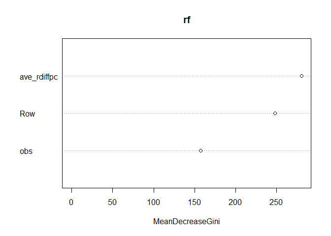

> Outline

1. Abstract 
2. IPQC data analysis (Part 1)
    + 2.1 Knowing the data
        - 2.1.1 Original data
        - 2.2.2 Data after preprocessing
    + 2.2 Analysis 
        - 2.2.1 SMOTE + Decision Tree
        - 2.2.2 SMOTE + Random Forest
        - 2.2.3 ROSE + Decision Tree
        - 2.2.4 ROSE + Random Forest
    + 2.3 Compare ROC curve
3. IPQC + FQC data analysis (Part 2)


# 1. Abstract
Machine learning models to predict the quality of manufacturing of blood glucose test strips are presented in this study. A variety of models are built by inspection data from an anonymous manufacturer in Taiwan. The aim of this study is to predict the quality of the strips in advance and to reduce the cost of defective products before shipment.
The proposed approach is divided into two parts. In-Process Quality Control (IPQC) data are examined in the first part. Since the data of defective products are relatively rare, we should make the data more balanced before building a model. Synthetic Minority Over-Sampling Technique (SMOTE) and Random Over-sampling Example (ROSE) are used to balance the data, and subsequently classification models are developed by the decision tree and random forest. Evaluation results from Receiver Operating Characteristic Curve (ROC) show that the decision tree and random forest after SMOTE have better performance than the counterpart of ROSE model.
After exploring the IPQC data, the second part of this study combines different inspection results of blood glucose test strips under same batch of raw materials. Standard deviation filtering and Principal Component Analysis (PCA) are used to select or extract appropriate features before building the models. Different clusterings from K-means, hierarchical, and K-medoids methods are employed to facilitate the understanding on quality grading for blood glucose test strips. Different clusterings are externally validated against original category labels. Results show that performance of more than three groups degrades significantly regardless of the cluster methods.

#### The process of this study as below.  

```r
knitr::include_graphics("C:/Users/Christine Liou/Documents/Quality-prediction-for-the-manufacturing-of-the-blood-glucose-strips/Analysis process.jpg")
```


# 2. IPQC data analysis (Part 1)
## 2.1 Knowing the data
### 2.1.1 Original data
The below data is original excel inputting from the company. It is quiet massy, so we need to extract, transform and reorganized. 

```r
library(xlsx)
IPQC_2233_GCS <- read.xlsx("~/HMD/data-20180426/IPQC/C4H82233-IPQC.xls",encoding="UTF-8",startRow =10,endRow = 23,sheetIndex = 1 )
IPQC_2233_GCS
```

```
##    GCS.Level Level.1 Level.1.1 Level.1.2 Level.1.3 Level.2 Level.2.1
## 1  GCS Model   GCS31     GCS31     GCS31     GCS31   GCS33     GCS33
## 2    ROW NO.       3         4         5         6       1         2
## 3  Meter No.      02        03        04        05      02        03
## 4    1(左吸)      41        41        35        41     293       298
## 5    2(左吸)      41        41        35        41     292       291
## 6    3(左吸)      42        41        37        39     286       303
## 7    4(左吸)      40        41        33        42     294       298
## 8    5(左吸)      42        41        36        41     293       301
## 9    6(右吸)      41        41        34        42     298       296
## 10   7(右吸)      41        41        32        42     293       291
## 11   8(右吸)      40        41        41        41     302       300
## 12   9(右吸)      41        40        42        42     295       295
## 13  10(右吸)      40        42        40        42     289       298
##    Level.2.2 Level.2.3 NA. NA..1 NA..2 NA..3 NA..4 NA..5 NA..6 NA..7 NA..8
## 1      GCS33     GCS33  NA    NA    NA    NA    NA    NA    NA    NA    NA
## 2          3         4  NA    NA    NA    NA    NA    NA    NA    NA    NA
## 3         04        05  NA    NA    NA    NA    NA    NA    NA    NA    NA
## 4        306       308  NA    NA    NA    NA     0     0     0     0     0
## 5        302       311  NA    NA    NA    NA     0     0     0     0     0
## 6        315       309  NA    NA    NA    NA     0     0     0     0     0
## 7        301       313  NA    NA    NA    NA     0     0     0     0     0
## 8        306       313  NA    NA    NA    NA     0     0     0     0     0
## 9        306       317  NA    NA    NA    NA     0     0     0     0     0
## 10       308       306  NA    NA    NA    NA     0     0     0     0     0
## 11       303       296  NA    NA    NA    NA     0     0     0     0     0
## 12       282       306  NA    NA    NA    NA     0     0     0     0     0
## 13       291       302  NA    NA    NA    NA     0     0     0     0     0
##    NA..9 NA..10 NA..11
## 1     NA     NA     NA
## 2     NA     NA     NA
## 3     NA     NA     NA
## 4      0      0      0
## 5      0      0      0
## 6      0      0      0
## 7      0      0      0
## 8      0      0      0
## 9      0      0      0
## 10     0      0      0
## 11     0      0      0
## 12     0      0      0
## 13     0      0      0
```


```r
library(reshape2)
IPQC_2233_GCS <- IPQC_2233_GCS[,1:9]
lookup <- IPQC_2233_GCS[1:3,]
lookup <- sapply(lookup,as.character)
lookup <- rbind(colnames(lookup),lookup)
colnames(lookup) <- NULL
lookup <- t(lookup)
lookup <- as.data.frame(lookup)
colnames(lookup) <- c("Level", "GCS","Row","Meter")
lookup <- lookup [-1,]
lapply(lookup, table, useNA = "ifany")
```

```
## $Level
## 
## GCS.Level   Level.1 Level.1.1 Level.1.2 Level.1.3   Level.2 Level.2.1 
##         0         1         1         1         1         1         1 
## Level.2.2 Level.2.3 
##         1         1 
## 
## $GCS
## 
## GCS Model     GCS31     GCS33 
##         0         4         4 
## 
## $Row
## 
##       1       2       3       4       5       6 ROW NO. 
##       1       1       2       2       1       1       0 
## 
## $Meter
## 
##        02        03        04        05 Meter No. 
##         2         2         2         2         0
```

```r
lookup$Level <- factor(lookup$Level)
lookup$Meter <- factor(lookup$Meter)
lookup$Row <- factor(lookup$Row)

IPQC_2233_GCS <- IPQC_2233_GCS[-(1:3),]
colnames(IPQC_2233_GCS)[1] <- "obs"

lIPQC_2233_GCS <- melt(IPQC_2233_GCS,id.vars = "obs", measure.vars = colnames(IPQC_2233_GCS)[-1],variable.name = "Level",value.name = "bg")
lIPQC_2233_GCS <- merge(lookup,lIPQC_2233_GCS,by="Level")
lIPQC_2233_GCS$Level <- ifelse(lIPQC_2233_GCS$Level == "Level.1" | lIPQC_2233_GCS$Level == "Level.1.1" | lIPQC_2233_GCS$Level == "Level.1.2"| lIPQC_2233_GCS$Level == "Level.1.3", "I", ifelse(lIPQC_2233_GCS$Level == "Level.2" | lIPQC_2233_GCS$Level == "Level.2.1" | lIPQC_2233_GCS$Level == "Level.2.2"| lIPQC_2233_GCS$Level =="Level.2.3", "II", lIPQC_2233_GCS$Level))
lIPQC_2233_GCS$bg <- as.numeric(lIPQC_2233_GCS$bg)
lIPQC_2233_GCS$Row <- as.character(lIPQC_2233_GCS$Row)

lIPQC_2233_GCS$ave_bg <- ave(lIPQC_2233_GCS$bg, list(lIPQC_2233_GCS$Row,lIPQC_2233_GCS$Level), FUN = function(x) mean(x, na.rm = TRUE))
lIPQC_2233_GCS$ave_rdiff <- lIPQC_2233_GCS$bg - lIPQC_2233_GCS$ave_bg
lIPQC_2233_GCS$ave_rdiffpc <- (lIPQC_2233_GCS$ave_rdiff/lIPQC_2233_GCS$ave_bg)*100
head(lIPQC_2233_GCS)
```

```
##   Level   GCS Row Meter     obs bg ave_bg ave_rdiff ave_rdiffpc
## 1     I GCS31   3    02 1(左吸) 41   40.9       0.1   0.2444988
## 2     I GCS31   3    02 2(左吸) 41   40.9       0.1   0.2444988
## 3     I GCS31   3    02 3(左吸) 42   40.9       1.1   2.6894866
## 4     I GCS31   3    02 4(左吸) 40   40.9      -0.9  -2.2004890
## 5     I GCS31   3    02 5(左吸) 42   40.9       1.1   2.6894866
## 6     I GCS31   3    02 6(右吸) 41   40.9       0.1   0.2444988
```

### 2.1.2 Data after preprocessing
After cleaning, transforming, and calculating, the whole IPQC data is combined. The first column marks the strips pass or not. The two to seven columns are the strip's tags, shows us the pass level, the batch name, the blood sugar rate levels, the row, the estimated meter, and the observed number. The "bg" column is the strip tested outcome. We use the same real blood to test the strip. Therefore, based on the same testing blood, the outcome of the strip should nearly the same. If the "bg" quite different from other strips, that means the strip might be bad quality. 


```r
load("~/HMD/RDATA/IPQC_all.RData")
head(IPQC)
```

```
##   passornot passlevel name Level Row Meter     obs bg ave_bg ave_rdiff
## 1      pass         A 2223     I   3    02 1(左吸) 40   39.5       0.5
## 2      pass         A 2223     I   3    02 2(左吸) 38   39.5      -1.5
## 3      pass         A 2223     I   3    02 3(左吸) 39   39.5      -0.5
## 4      pass         A 2223     I   3    02 4(左吸) 40   39.5       0.5
## 5      pass         A 2223     I   3    02 5(左吸) 40   39.5       0.5
## 6      pass         A 2223     I   3    02 6(右吸) 40   39.5       0.5
##   ave_rdiffpc
## 1    1.265823
## 2   -3.797468
## 3   -1.265823
## 4    1.265823
## 5    1.265823
## 6    1.265823
```

After removing the outlier based on boxplot, the strips with the same Row and obs are drawn a boxplot according to the 'ave_rdiffpc'(averaged of the row difference percentage). As we can see, the boxplots of the pass have more similar average and IQR than NG.

```r
library(dplyr)
```

```
## 
## Attaching package: 'dplyr'
```

```
## The following objects are masked from 'package:stats':
## 
##     filter, lag
```

```
## The following objects are masked from 'package:base':
## 
##     intersect, setdiff, setequal, union
```

```r
IPQC_PASS <- filter(IPQC, IPQC$passornot=="pass")
IPQC_NG <- filter(IPQC, IPQC$passornot=="NG")
a <- which(IPQC_PASS$ave_rdiffpc %in% boxplot.stats(IPQC_PASS$ave_rdiffpc)$out) #removed the outlier
IPQC_PASS <- IPQC_PASS[-a,]
IPQC <- rbind(IPQC_PASS,IPQC_NG)

library(ggplot2)
p_naout <- ggplot(IPQC, aes(x=obs, y=ave_rdiffpc))+ geom_boxplot() + theme(axis.text.x = element_text(angle = 45))+ facet_grid(Row ~passornot)+ scale_x_discrete(limits= c("1(左吸)","2(左吸)","3(左吸)","4(左吸)","5(左吸)","6(右吸)","7(右吸)","8(右吸)","9(右吸)","10(右吸)")) 
p_naout+ ggtitle("Boxplot IPQC before balance_remove pass outlier")
```

<!-- -->

The difference between pass and NG might have two reasons. First, the variance of the data should be small result in the pass strips. In other words, because ave_rdiffpc of the strips are quite diverse, the strips are not passed. Therefore, the boxplot in the NG part has different shapes. The other reason might be the number of data. With fewer collected data, the boxplot of NG would be quiet different. 
According to the codes below, we have 3993 pass data and only 160 NG data. 

```r
library(DMwR)
```

```
## Loading required package: lattice
```

```
## Loading required package: grid
```

```r
set.seed(1111)
table(IPQC$passornot)
```

```
## 
## pass   NG 
## 3993  160
```

## 2.2 Analysis
### 2.2.1 SMOTE + Decision Tree
Our data is imbalanced data. Applying machine learning model with imbalance data often causes the model to develop a bias towards the majority class. Therefore, we should balance the data first and then build the classification model. SMOTE is based on nearest neighbors judged by Euclidean Distance between data points in feature space. It selects examples that are close in the feature space, drawing a line between the examples in the feature space and drawing a new sample at a point along that line.

```r
IPQC_SMOTE <- SMOTE(passornot ~ ., IPQC, perc.over = 1150,perc.under=150)
table(IPQC_SMOTE$passornot)
```

```
## 
## pass   NG 
## 2640 1920
```

After SMOTE, as we can see the  NG boxplot at the right side has better performance. The boxplots look quite similar. 

```r
smote <- ggplot(IPQC_SMOTE, aes(x=obs, y=ave_rdiffpc))+ geom_boxplot() + theme(axis.text.x = element_text(angle = 45))+ facet_grid(Row ~passornot)+ scale_x_discrete(limits= c("1(左吸)","2(左吸)","3(左吸)","4(左吸)","5(左吸)","6(右吸)","7(右吸)","8(右吸)","9(右吸)","10(右吸)")) 
smote + ggtitle("Boxplot IPQC after SMOTE")
```

<!-- -->

Separate the data into training set and testing set.

```r
### 資料切分
np <- ceiling(0.1*nrow(IPQC_SMOTE))
test <- sample(1:nrow(IPQC_SMOTE),np)
IPQC_test <- IPQC_SMOTE[test,]
IPQC_train <- IPQC_SMOTE[-test,]

table(IPQC_train$passornot)/nrow(IPQC_train)
```

```
## 
##      pass        NG 
## 0.5772417 0.4227583
```

```r
table(IPQC_test$passornot)/nrow(IPQC_test)
```

```
## 
##      pass        NG 
## 0.5942982 0.4057018
```

Build the decision tree by rpart. 

```r
library(rpart)
IPQC_tree <- rpart(passornot ~   Row+obs + ave_rdiffpc, 
                   data = IPQC_train,
                   method = "class")  
IPQC_tree
```

```
## n= 4104 
## 
## node), split, n, loss, yval, (yprob)
##       * denotes terminal node
## 
##  1) root 4104 1735 pass (0.5772417 0.4227583)  
##    2) Row=1,2,4,5,6 2449  694 pass (0.7166190 0.2833810) *
##    3) Row=3 1655  614 NG (0.3709970 0.6290030)  
##      6) obs=1(左吸),10(右吸),7(右吸),8(右吸),9(右吸) 591  279 pass (0.5279188 0.4720812)  
##       12) ave_rdiffpc>=-1.892034 429  174 pass (0.5944056 0.4055944) *
##       13) ave_rdiffpc< -1.892034 162   57 NG (0.3518519 0.6481481) *
##      7) obs=2(左吸),3(左吸),4(左吸),5(左吸),6(右吸) 1064  302 NG (0.2838346 0.7161654) *
```

Pruning

```r
### 剪枝
printcp(IPQC_tree)
```

```
## 
## Classification tree:
## rpart(formula = passornot ~ Row + obs + ave_rdiffpc, data = IPQC_train, 
##     method = "class")
## 
## Variables actually used in tree construction:
## [1] ave_rdiffpc obs         Row        
## 
## Root node error: 1735/4104 = 0.42276
## 
## n= 4104 
## 
##         CP nsplit rel error  xerror     xstd
## 1 0.246110      0   1.00000 1.00000 0.018240
## 2 0.023343      1   0.75389 0.75389 0.017206
## 3 0.010000      3   0.70720 0.70893 0.016916
```

```r
plotcp(IPQC_tree)
```

<!-- -->

```r
#取最小錯誤率剪枝
prunetree_IPQC <- prune(IPQC_tree, cp = IPQC_tree$cptable[which.min(IPQC_tree$cptable[,"xerror"]),"CP"])

#取最小錯誤率加上一倍標準誤
opt <- which.min(IPQC_tree$cptable[,"xerror"])
oneSe <- which(IPQC_tree$cptable[, "rel error"] < 
                IPQC_tree$cptable[opt,"xerror"] + IPQC_tree$cptable[opt, "xstd"])[1]

cpOneSe <- IPQC_tree$cptable[oneSe, "CP"]
IPQC_pruneOneSe <- prune(IPQC_tree, cp = cpOneSe)

knitr::kable(
  IPQC_tree$cptable, caption = ' 分類樹複雜度參數表',
  booktabs = TRUE
)
```


Table:  分類樹複雜度參數表

        CP   nsplit   rel error      xerror        xstd
----------  -------  ----------  ----------  ----------
 0.2461095        0   1.0000000   1.0000000   0.0182402
 0.0233429        1   0.7538905   0.7538905   0.0172056
 0.0100000        3   0.7072046   0.7089337   0.0169158

Visualize the result of the tree.

```r
### 畫圖
library(rpart.plot)
#opar<-par(no.readonly = T)
#par(mfrow=c(1,2))
rpart.plot(IPQC_tree, digits = 3, cex=0.8, sub="剪枝前")
```

<!-- -->

```r
rpart.plot(prunetree_IPQC, digits = 3, cex=0.8, sub="剪枝後")
```

<!-- -->

```r
rpart.plot(IPQC_pruneOneSe, digits = 3, cex=0.8, sub="onese剪枝後")
```

<!-- -->

```r
#剪枝前後差不多，因為cp最小取0.01，而原本rpart預設值就是0.01所以沒啥差
```

Calculate the accuracy and sensitivity of training set.

```r
#訓練集
passornot_train <- IPQC_SMOTE$passornot[-test]
train_prob <- predict(IPQC_tree,IPQC_train, type = "prob")
train_label <- predict(IPQC_tree,IPQC_train, type = "class")

table_train <- table(passornot_train,train_label)
correct_train <- sum(diag(table_train))/sum(table_train)*100
correct_train #69.56699
```

```
## [1] 70.10234
```

```r
sensitivity <- table_train[2,2]/sum(table_train[2,])*100
sensitivity # 69.99227
```

```
## [1] 49.97118
```

Calculate the accuracy and sensitivity of testing set. 

```r
#測試集
passornot_test <- IPQC_SMOTE$passornot[test]
test_prob <- predict(IPQC_tree,IPQC_test, type = "prob")
test_label <- predict(IPQC_tree,IPQC_test, type = "class")
table_test <- table(passornot_test,test_label)
# data.frame(test_prob, test_label)
correct_test <- sum(diag(table_test))/sum(table_test)*100
correct_test #訓練集資料正確率 63.23529 %  
```

```
## [1] 67.54386
```

```r
sensitivity <- table_test[2,2]/sum(table_test[2,])*100
sensitivity #測試集的sensitivity 65.98639%
```

```
## [1] 42.16216
```

Draw the ROC curve.

```r
### ROC curve
library(pROC)
```

```
## Type 'citation("pROC")' for a citation.
```

```
## 
## Attaching package: 'pROC'
```

```
## The following objects are masked from 'package:stats':
## 
##     cov, smooth, var
```

```r
levels(IPQC_test$passornot)
```

```
## [1] "pass" "NG"
```

```r
head(IPQC_test$passornot)
```

```
## [1] NG   NG   NG   NG   pass NG  
## Levels: pass NG
```

```r
str(IPQC_test$passornot) # "pass": 1, "NG":2
```

```
##  Factor w/ 2 levels "pass","NG": 2 2 2 2 1 2 1 2 2 2 ...
```

```r
modelroc_Stree <- roc(IPQC_test$passornot,test_prob[,"NG"]) # "pass": 1, "NG":2
```

```
## Setting levels: control = pass, case = NG
```

```
## Setting direction: controls < cases
```

```r
plot(modelroc_Stree, print.auc=TRUE, auc.polygon=TRUE, grid=c(0.1, 0.2),grid.col=c("green", "red"), max.auc.polygon=TRUE, auc.polygon.col="skyblue", print.thres=TRUE)
```

<!-- -->


```r
library(pROC)
modelroc_Stree <- roc(IPQC_test$passornot,test_prob[,"NG"]) # "pass": 1, "NG":2
```

```
## Setting levels: control = pass, case = NG
```

```
## Setting direction: controls < cases
```

### 2.2.2 SMOTE + Random Forest
Build the random forest model. 

```r
### 建隨機森林
library(randomForest)
```

```
## randomForest 4.6-14
```

```
## Type rfNews() to see new features/changes/bug fixes.
```

```
## 
## Attaching package: 'randomForest'
```

```
## The following object is masked from 'package:ggplot2':
## 
##     margin
```

```
## The following object is masked from 'package:dplyr':
## 
##     combine
```

```r
#set.seed(1117)
rf <- randomForest(passornot ~ Row + obs + ave_rdiffpc, data = IPQC_train, ntree = 100)
rf
```

```
## 
## Call:
##  randomForest(formula = passornot ~ Row + obs + ave_rdiffpc, data = IPQC_train,      ntree = 100) 
##                Type of random forest: classification
##                      Number of trees: 100
## No. of variables tried at each split: 1
## 
##         OOB estimate of  error rate: 28.53%
## Confusion matrix:
##      pass   NG class.error
## pass 1918  451   0.1903757
## NG    720 1015   0.4149856
```

```r
plot(rf)
```

<!-- -->


```r
### 變數重要性
importance(rf) 
```

```
##             MeanDecreaseGini
## Row                 247.9873
## obs                 157.0618
## ave_rdiffpc         280.7859
```

```r
varImpPlot(rf)
```

<!-- -->

Tuning the mtry 

```r
### CV調mtry
library(caret)
#set.seed(100)
mtryGrid <- data.frame(mtry = floor(seq(1, ncol(IPQC_train), length = 10)))
rfTune <- train(passornot ~ Row + obs + ave_rdiffpc, 
                data = IPQC_train,
                method = "rf",
                tuneGrid = mtryGrid,
                ntree = 100,
                importance = TRUE,
                trControl = trainControl(method = "cv",number = 10))
rfTune
```

```
## Random Forest 
## 
## 4104 samples
##    3 predictor
##    2 classes: 'pass', 'NG' 
## 
## No pre-processing
## Resampling: Cross-Validated (10 fold) 
## Summary of sample sizes: 3694, 3694, 3694, 3693, 3694, 3693, ... 
## Resampling results across tuning parameters:
## 
##   mtry  Accuracy   Kappa    
##    1    0.6608225  0.2393996
##    2    0.7005436  0.3667809
##    3    0.7039523  0.3761501
##    4    0.7115079  0.3932122
##    5    0.7212611  0.4149653
##    6    0.7261278  0.4260196
##    7    0.7370886  0.4505503
##    8    0.7405044  0.4582096
##    9    0.7446430  0.4676102
##   11    0.7485396  0.4752906
## 
## Accuracy was used to select the optimal model using the largest value.
## The final value used for the model was mtry = 11.
```

```r
plot(rfTune)
```

<!-- -->

Calculate the accuracy and sensitivity of testing set.

```r
passornot_test <- IPQC_SMOTE$passornot[test]
test_prob <- predict(rfTune,IPQC_test, type = "prob")
test_label <- predict(rfTune,IPQC_test, type = "raw")
table_test <- table(passornot_test,test_label)

correct_test <- sum(diag(table_test))/sum(table_test)*100
correct_test #測試集資料正確率 69.48529 %  
```

```
## [1] 74.7807
```

```r
sensitivity <- table_test[2,2]/sum(table_test[2,])*100
sensitivity #測試集的sensitivity 75.1634%
```

```
## [1] 59.45946
```


Plot the ROC curve. 

```r
### ROC
library(pROC)
modelroc_Srf <- roc(IPQC_test$passornot,test_prob[,"NG"]) # "pass": 1, "NG":2
```

```
## Setting levels: control = pass, case = NG
```

```
## Setting direction: controls < cases
```

```r
plot(modelroc_Srf, print.auc=TRUE, auc.polygon=TRUE, grid=c(0.1, 0.2),grid.col=c("green", "red"), max.auc.polygon=TRUE, auc.polygon.col="skyblue", print.thres=TRUE)
```

<!-- -->


### 2.2.3 ROSE + Decision Tree
In addition to using SMOTE to balance the data, I also use another method provided in R called ROSE(Random Over-sampling Example). After ROSE, the pass data and NG data have samilar number of data.

```r
library(ROSE)
```

```
## Loaded ROSE 0.0-3
```

```r
set.seed(111)
IPQC_ROSE <- ROSE(passornot~., data=IPQC,N=nrow(IPQC), p=0.5, seed=1, hmult.majo = 0.25, hmult.mino = 0.5)$data            
#ROSE函數包的人工合成數據(ROSE)、過採樣、欠採樣及融合過採樣和欠採樣，根據Nicola文章，ROSE的ROCcurve 表現優於其他三者，所以採用ROSE套件中的ROSE函數進行數據平衡

table(IPQC_ROSE$passornot)
```

```
## 
## pass   NG 
## 2151 2002
```

The boxplot after ROSE as below. 

```r
rose <- ggplot(IPQC_ROSE, aes(x=obs, y=ave_rdiffpc))+ geom_boxplot() + theme(axis.text.x = element_text(angle = 45))+ facet_grid(Row ~passornot)+ scale_x_discrete(limits= c("1(左吸)","2(左吸)","3(左吸)","4(左吸)","5(左吸)","6(右吸)","7(右吸)","8(右吸)","9(右吸)","10(右吸)")) 
rose+ ggtitle("Boxplot IPQC after ROSE")
```

<!-- -->

Saperate the data into training and testing set. 

```r
### 資料切分
np <- ceiling(0.1*nrow(IPQC_ROSE))
test <- sample(1:nrow(IPQC_ROSE),np)
IPQC_test <- IPQC_ROSE[test,]
IPQC_train <- IPQC_ROSE[-test,]
```


Build the decision tree. 

```r
### 建樹
library(rpart)
IPQC_tree <- rpart(passornot ~   Row + obs + ave_rdiffpc, method = "class", data = IPQC_train, control = rpart.control(minbucket = 200)) 

### 剪枝
printcp(IPQC_tree)
```

```
## 
## Classification tree:
## rpart(formula = passornot ~ Row + obs + ave_rdiffpc, data = IPQC_train, 
##     method = "class", control = rpart.control(minbucket = 200))
## 
## Variables actually used in tree construction:
## [1] ave_rdiffpc obs        
## 
## Root node error: 1797/3737 = 0.48087
## 
## n= 3737 
## 
##         CP nsplit rel error  xerror     xstd
## 1 0.094880      0   1.00000 1.00000 0.016997
## 2 0.012521      2   0.81024 0.83027 0.016660
## 3 0.010000      4   0.78520 0.82526 0.016643
```

```r
plotcp(IPQC_tree)
```

<!-- -->

```r
prunetree_IPQC <- prune(IPQC_tree, cp = IPQC_tree$cptable[which.min(IPQC_tree$cptable[,"xerror"]),"CP"])


### 畫圖
library(rpart.plot)
#opar<-par(no.readonly = T)
#par(mfrow=c(1,2))
rpart.plot(IPQC_tree, digits = 3, cex=0.8, sub="剪枝前")
```

<!-- -->

```r
rpart.plot(prunetree_IPQC, digits = 3, cex=0.8)
```

<!-- -->

```r
#剪枝前後一樣

rpart.rules(x = IPQC_tree,cover = TRUE)
```

```
##  passornot                                                                                                                       cover
##       0.32 when ave_rdiffpc is -3.8 to  2.5 & obs is                                            10(右吸) or 4(左吸) or 8(右吸)     20%
##       0.42 when ave_rdiffpc is -1.9 to  2.5 & obs is 1(左吸) or 2(左吸) or 3(左吸) or 5(左吸) or 6(右吸) or 7(右吸) or 9(右吸)     45%
##       0.56 when ave_rdiffpc is -3.8 to -1.9 & obs is 1(左吸) or 2(左吸) or 3(左吸) or 5(左吸) or 6(右吸) or 7(右吸) or 9(右吸)     10%
##       0.65 when ave_rdiffpc >=          2.5                                                                                        16%
##       0.77 when ave_rdiffpc <  -3.8                                                                                                 8%
```

Calculate the accuracy and sensitivity of training set.


```r
### 模型評估
#訓練集
passornot_train <- IPQC_ROSE$passornot[-test]
train_prob <- predict(IPQC_tree,IPQC_train, type = "prob")
train_label <- predict(IPQC_tree,IPQC_train, type = "class")

table_train <- table(passornot_train,train_label)
correct_train <- sum(diag(table_train))/sum(table_train)*100
correct_train #69.56699
```

```
## [1] 62.24244
```

```r
sensitivity <- table_train[2,2]/sum(table_train[2,])*100
sensitivity # 69.99227
```

```
## [1] 46.57763
```

Calculate the accuracy and sensitivity of training set.

```r
#測試集的正確率
passornot_test <- IPQC_ROSE$passornot[test]
test_prob <- predict(IPQC_tree,IPQC_test, type = "prob")
test_label <- predict(IPQC_tree,IPQC_test, type = "class")
table_test <- table(passornot_test,test_label)
# data.frame(test_prob, test_label)

correct_test <- sum(diag(table_test))/sum(table_test)*100
correct_test #測試集資料正確率 71.2963 %  
```

```
## [1] 58.17308
```

```r
sensitivity <- table_test[2,2]/sum(table_test[2,])*100
sensitivity #測試集的sensitivity 15.38462 %
```

```
## [1] 42.92683
```


Draw the ROC curve.

```r
# ROC
library(pROC)
modelroc_Rtree <- roc(IPQC_test$passornot,test_prob[,"NG"]) # "pass": 1, "NG":2
```

```
## Setting levels: control = pass, case = NG
```

```
## Setting direction: controls < cases
```

```r
plot(modelroc_Rtree, print.auc=TRUE, auc.polygon=TRUE, grid=c(0.1, 0.2),grid.col=c("green", "red"), max.auc.polygon=TRUE, auc.polygon.col="skyblue", print.thres=TRUE)
```

<!-- -->

### 2.2.4 ROSE + Random Forest
Build the random forest model.

```r
#建森林
library(randomForest)
#set.seed(111)
rf <- randomForest(passornot ~ Row + obs + ave_rdiffpc, data = IPQC_train, ntree = 100)
rf_predict <- predict(rf, newdata = IPQC_test)
rf 
```

```
## 
## Call:
##  randomForest(formula = passornot ~ Row + obs + ave_rdiffpc, data = IPQC_train,      ntree = 100) 
##                Type of random forest: classification
##                      Number of trees: 100
## No. of variables tried at each split: 1
## 
##         OOB estimate of  error rate: 34.15%
## Confusion matrix:
##      pass  NG class.error
## pass 1597 343   0.1768041
## NG    933 864   0.5191987
```

```r
plot(rf)
```

<!-- -->


Tuning the mtry. 

```r
### CV調mtry
library(caret)
#set.seed(100)
mtryGrid <- data.frame(mtry = floor(seq(1, ncol(IPQC_train), length = 10)))
rfTune <- train(passornot ~ Row + obs + ave_rdiffpc, 
                data = IPQC_train,
                method = "rf",
                tuneGrid = mtryGrid,
                ntree = 100,
                importance = TRUE,
                trControl = trainControl(method = "cv",number = 10))
rfTune
```

```
## Random Forest 
## 
## 3737 samples
##    3 predictor
##    2 classes: 'pass', 'NG' 
## 
## No pre-processing
## Resampling: Cross-Validated (10 fold) 
## Summary of sample sizes: 3363, 3364, 3364, 3363, 3363, 3363, ... 
## Resampling results across tuning parameters:
## 
##   mtry  Accuracy   Kappa      
##    1    0.5210105  0.004451362
##    2    0.5654256  0.106690926
##    3    0.6208226  0.227613311
##    4    0.6577511  0.306189700
##    5    0.6783573  0.350410577
##    6    0.6847773  0.365260253
##    7    0.6845149  0.366161631
##    8    0.6882589  0.374066770
##    9    0.6845185  0.366905899
##   11    0.6724692  0.343228642
## 
## Accuracy was used to select the optimal model using the largest value.
## The final value used for the model was mtry = 8.
```

```r
plot(rfTune)
```

<!-- -->

Calculate the accuracy and sensitivity of testing set.

```r
### 測試集評估

passornot_test <- IPQC_ROSE$passornot[test]
test_prob <- predict(rf,IPQC_test, type = "prob")
test_label <- predict(rfTune,IPQC_test, type = "raw")
table_test <- table(passornot_test,test_label)

correct_test <- sum(diag(table_test))/sum(table_test)*100
correct_test #測試集資料正確率 69.48529 %  
```

```
## [1] 67.54808
```

```r
sensitivity <- table_test[2,2]/sum(table_test[2,])*100
sensitivity #測試集的sensitivity 75.1634%
```

```
## [1] 62.92683
```


Draw ROC curve

```r
### ROC
library(pROC)
modelroc_Rrf <- roc(IPQC_test$passornot,test_prob[,"NG"]) # "pass": 1, "NG":2
```

```
## Setting levels: control = pass, case = NG
```

```
## Setting direction: controls < cases
```

```r
plot(modelroc_Rrf, print.auc=TRUE, auc.polygon=TRUE, grid=c(0.1, 0.2),grid.col=c("green", "red"), max.auc.polygon=TRUE, auc.polygon.col="skyblue", print.thres=TRUE)
```

<!-- -->

```r
### 變數重要性
rfImp <- varImp(rfTune, scale = FALSE)
rfImp
```

```
## rf variable importance
## 
##             Importance
## ave_rdiffpc     49.045
## Row3            14.943
## Row5            14.456
## Row4            14.039
## obs3(左吸)      13.802
## obs4(左吸)      12.834
## Row2            12.248
## obs6(右吸)      11.896
## Row6            11.541
## obs9(右吸)      11.256
## obs10(右吸)     10.603
## obs7(右吸)       9.992
## obs2(左吸)       8.836
## obs8(右吸)       8.712
## obs5(左吸)       6.779
```

## 2.3 Compare ROC curve

```r
# compared four ROC curve ####
library(pROC)
library(ggplot2)
roc_tree <- ggroc(list(smote_tree=modelroc_Stree,rose_tree=modelroc_Rtree), legacy.axes = TRUE, aes =c("linetype")) + labs(x = "FPR" , y = "TPR")
roc_tree
```

<!-- -->

```r
roc_rf <- ggroc(list(smote_rf=modelroc_Srf,rose_rf=modelroc_Rrf),legacy.axes = TRUE,aes =c("linetype", "color")) + labs(x = "FPR" , y = "TPR")
roc_rf
```

<!-- -->

```r
roc_rf <- ggroc(list(smote_rf=modelroc_Srf,rose_rf=modelroc_Rrf),legacy.axes = TRUE,aes =c("linetype")) + labs(x = "FPR" , y = "TPR")
roc_rf
```

<!-- -->

```r
roc <- ggroc(list(smote_rf=modelroc_Srf,rose_rf=modelroc_Rrf,smote_tree=modelroc_Stree,rose_tree=modelroc_Rtree), legacy.axes = TRUE,aes =c("linetype")) + labs(x = "FPR" , y = "TPR")
roc
```

<!-- -->

